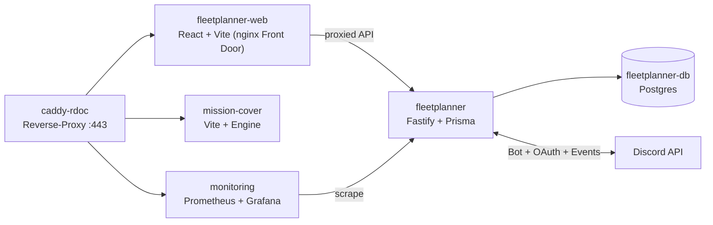

# CLAUDE.md

This file provides guidance to Claude Code (claude.ai/code) when working with code in this repository.

## Projektname

RDOC-Suite — **Fleetplanner** für Star-Citizen-Orgs (Event-/Op-Planung, Discord-Integration).

> **Historie:** Das Repo war ursprünglich eine „Discord Channel Commander Voice Bridge" (RDCC +
> RDOC-RTC + VoiceRelayBots). Der komplette Voice-Stack (`apps/bot`, `apps/bridge`,
> `apps/relay-bots`, LiveKit) wurde entfernt (`dbd2c3f chore: remove legacy voice/CC stack`;
> LiveKit 2026-06-18). Restore-Referenz nur noch als Doku: `docs/LIVEKIT-ARCHIVE-2026-06.md`.
> `apps/companion` (Tauri-Desktop-App) + `packages/shared` wurden 2026-08-07 entfernt — Voice läuft
> über **Subraum** (subraum.cc, frueher RDOC SquadLink; eigenes Repo, Windows Store; im Fleetplanner nur über die
> `SQUADLINK_*`-Env angebunden).
> `packages/db`, Root-`prisma/` und die Root-`pnpm db:*`-Skripte sind **2026-08-22 gelöscht** — sie
> waren das Bridge/Bot-Schema ohne lebenden Consumer. Prisma lebt nur noch in
> `apps/fleetplanner/prisma`.

## Merge-Log zuerst — immer

**Bevor du irgendetwas tust (Code, Config, Docs): füge einen "Queued / Planned Step"-Eintrag (mit `YYYY-MM-DD:`-Prefix) in [`docs/RDOC-SUITE-MERGELOG.md`](docs/RDOC-SUITE-MERGELOG.md) ein.** Keine Ausnahmen. Protokoll:

- **Queued / Planned Step** — Eintrag *vor* der Arbeit schreiben, was geändert wird und warum.
- **Completed Steps** — nach Commit hierher verschieben/kopieren, Commit-Hash anhängen.
- **Open Decisions** — ungeklärte Architekturfragen; entfernen wenn entschieden.

Offene Entscheidungen (Stand 2026-08-22):
1. **Package-Namespace**: ✓ Entschieden — `@rdoc-suite/*` (war `@dccc/*`, umbenannt 2026-05-31).
2. **Voice-Era-Reste löschen?** ✓ Erledigt — `apps/companion` + `packages/shared` (2026-08-07),
   `packages/db` + Root-`prisma/` + Root-`db:*`-Skripte + Root-`Caddyfile` (2026-08-22).
3. **`MANAGE_CHANNELS`/`CONNECT`/`MOVE_MEMBERS`/`MANAGE_ROLES` aus der Bot-Invite-URL nehmen?**
   Offen — Least Privilege spricht dafür, es ändert aber die Installations-URL.

## Deploy-Regeln — immer einhalten

**RDOC-Suite ≠ DCCC. Zwei verschiedene Server, zwei verschiedene Projekte.**

| Projekt | Server | Pfad | Stack |
|---|---|---|---|
| **RDOC-Suite** | `10.10.10.99` | `/opt/RDOC-Suite` | `docker compose -f docker-compose.prod.yml` |
| **DCCC** | `10.10.10.97` (headwig) | `/opt/discord-channel-commander` | `docker compose -f docker-compose.prod.yml` |

Reverse-Proxy in Prod = **Caddy** ([`deploy/caddy-rdoc/Caddyfile`](deploy/caddy-rdoc/Caddyfile),
Service `caddy-rdoc`, host-network, TLS via Cloudflare-DNS-01) — nicht Traefik. Ein Root-`Caddyfile`
gibt es nicht mehr (2026-08-22 gelöscht: es proxied noch `bridge:8787` und `livekit:7880`).

**RDOC-Suite Deploy:**
```bash
cd /opt/RDOC-Suite
git pull
docker compose -f docker-compose.prod.yml up -d --build             # alle Services
docker compose -f docker-compose.prod.yml up -d --build fleetplanner      # Backend/API einzeln
docker compose -f docker-compose.prod.yml up -d --build fleetplanner-web   # SPA-Frontend (Nav/UX)
docker compose -f docker-compose.prod.yml logs -f fleetplanner
```

Prod-Services (aus `docker-compose.prod.yml`): `caddy-rdoc`, `fleetplanner`, `fleetplanner-web`,
`fleetplanner-db` (Postgres), `error-page`, `mission-cover`, `monitoring` (Prometheus),
`alertmanager`, `postgres-exporter`, `node-exporter`, `grafana`.

Alle Infra-/Deploy-Informationen liegen in [`docs/`](docs/) — kein STAND.md mehr.

## Discord Bots

Es gibt **genau einen** Bot. Der frühere RDOC-RTC-Voice-Bridge-Bot (App `1507722962919227452`,
`/cc`, Bridge-OAuth), die Companion-OAuth-App und die **Funkrelais-Bots** sind entfernt — letztere
restlos: kein `GuildVoiceBot`-Modell, kein Service, keine Route, keine Oberfläche (geprüft
2026-08-12).

| Bot | Env-Vars | Zweck |
|---|---|---|
| **RDOC-Fleetplanner Bot** (Prod App `1509191397264064689`, Portal-Name `RDOC-Fleetplanner`) | `DISCORD_FLEETPLANNER_BOT_TOKEN`, `DISCORD_FLEETPLANNER_CLIENT_ID`, `DISCORD_FLEETPLANNER_PUBLIC_KEY` | Scheduled Events, Feedback-Tickets, Ankündigungen, DMs, Interest-Abgleich, Interaction-Buttons |

**REST-only.** Der Bot hält keine Gateway-Verbindung und nutzt keine Client-Bibliothek (kein
discord.js) — nur `fetch` gegen `DISCORD_API_BASE` plus Ed25519-verifizierte HTTP-Interactions.
Gateway-**Intents sind damit irrelevant**; die frühere Angabe „Intents: Guilds, GuildVoiceStates"
war Voice-Ära-Rest.

### Bot-Permissions

Angefordert werden in `BOT_PERMISSIONS` ([routes/guilds.ts](apps/fleetplanner/src/routes/guilds.ts))
neun Bits. Tatsächlich benutzt werden fünf:

| Permission | Bit | Benutzt? |
|---|---|---|
| `VIEW_CHANNEL` | 10 | ja — Kanäle lesen |
| `SEND_MESSAGES` | 11 | ja — Tickets, Ankündigungen |
| `READ_MESSAGE_HISTORY` | 16 | ja |
| `MANAGE_EVENTS` | 33 | ja — Scheduled Events |
| `ADD_EVENTS` | 44 | ja |
| `MANAGE_CHANNELS` | 4 | **nein** |
| `CONNECT` | 20 | **nein** |
| `MOVE_MEMBERS` | 24 | **nein** |
| `MANAGE_ROLES` | 28 | **nein** — der Bot *liest* nur `admiralRoleId`, er vergibt keine Rollen |

Die vier unbenutzten sind Reste des Voice-Stacks. Sie gehören aus der Invite-URL entfernt (Least
Privilege); das ändert die Installations-URL, deshalb eine bewusste Entscheidung und kein
Nebenbei-Fix.

**Token 401 → immer:** Discord Developer Portal → richtige App → Bot → Reset Token → `.env` updaten → Container neu starten.

## Regeln für Claude Code — immer befolgen

1. **Mergelog zuerst, immer.** Vor JEDER Änderung: Queued-Eintrag in `docs/RDOC-SUITE-MERGELOG.md`. Keine Ausnahmen.

2. **RDOC-Suite ≠ DCCC.** Nie verwechseln (siehe Deploy-Regeln oben).

3. **Prod-Zugang NUR über Proxmox-Host → LXC 103.** Niemals direktes `ssh root@10.10.10.99` (User: „fireable offense"). Pfad:
   `ssh -i ~/.ssh/claude_deploy root@ve.raumdock.org "pct exec 103 -- sh -c '<cmd>'"`
   - Key `~/.ssh/claude_deploy` (NICHT die `id_ed25519*`-Defaults). RDOC-Suite liegt in LXC 103 unter `/opt/RDOC-Suite`. Für Befehle `pct exec 103 --` (nicht das interaktive `pct enter`).
   - Deploy macht der User normalerweise selbst; nur deployen wenn explizit beauftragt.

4. **GitHub-Push über gh-Credential-Helper.** Die SSH-Keys authentifizieren NICHT gegen GitHub. `gh` ist als `cccdemon` eingeloggt (https):
   `git -c credential.helper="!gh auth git-credential" push https://github.com/cccdemon/RDOC-Suite.git master`

5. **Kein lokales pnpm/npm/cargo.** Docker baut alles server-seitig. Dockerfile bootstrappt sich selbst.

6. **Code first, compile last.** Ganzes Feature end-to-end schreiben, dann alle Type-Errors in einem Batch fixen.

7. **Docs nur in `docs/`.** Kein STAND.md. Infra-Wahrheit liegt in `docs/RDOC-SUITE-MERGELOG.md` (Code = Ground Truth). Erledigte Handover-/Plan-/Implementation-Log-Docs löschen statt veralten lassen — Historie bleibt im Mergelog.

8. **Zwei Changelogs — immer beide pflegen.**
   - `CHANGELOG.md` (Entwickler) unter `## [Unreleased]` nach jeder Coding-Session — Einträge für alle Änderungen.
   - [`apps/fleetplanner/src/lib/changelog.ts`](apps/fleetplanner/src/lib/changelog.ts) (**Spieler**, sichtbar unter `/handbuch/changelog`) bei jedem user-sichtbaren Feature — kurz, spielerlesbar, EN, neueste zuerst. Kein Git-Log, keine Schema-/Service-Namen.

9. **FeatureRequest-/Plan-Docs:** ein Feature pro File, Dateiname `docs/FR-P<n>-<feature>.md` (n = Prio, 1 höchste … 5 niedrigste). Header: FR-Marker + Prio + **Dependency-Block** (Abhängigkeiten sichtbar machen). In die Planungstabelle unten eintragen.

10. **Regeln in CLAUDE.md schreiben** wenn der User sie nennt — nicht nur in Memory.

## Operative Hinweise für Claude Code

### Häufige Commands — Lokales Dev

```bash
# Installation und Setup
pnpm install

# Fleetplanner hat ein eigenes Prisma-Schema (PostgreSQL in Prod, SQLite lokal)
pnpm --filter @rdoc-suite/fleetplanner db:generate   # nach frischem Clone zwingend
pnpm --filter @rdoc-suite/fleetplanner db:push       # lokal (SQLite, kein Migrations-History)
# Prod: Migrationen laufen automatisch beim Container-Start via entrypoint

# Build / Lint / Format / Test (alle Workspaces)
pnpm build
pnpm lint
pnpm format
pnpm test                   # vitest in jedem Workspace mit test-Skript

# Einzelnes Workspace entwickeln (Watch-Mode)
pnpm --filter @rdoc-suite/fleetplanner dev
pnpm --filter @rdoc-suite/fleetplanner-web dev   # React/Vite SPA (Fleetplanner-Frontend)
pnpm --filter @rdoc-suite/fleetplanner-contracts build  # nach Contract-Änderung, vor SPA-Typecheck
pnpm --filter @rdoc-suite/mission-cover dev

# Einzelne Tests laufen lassen
pnpm --filter @rdoc-suite/fleetplanner test -- <datei>     # nur eine Test-Datei
pnpm --filter @rdoc-suite/fleetplanner test -- -t "name"   # einzelner it("name", ...) Block
```

**Testsuite: alles laeuft lokal gegen den Docker-Stack, Discord wird simuliert.**
Eine Wahrheit dazu: [`docs/TESTING.md`](docs/TESTING.md).

```bash
./scripts/test-stack.sh up      # lokalen Stack bauen + starten (web :8099, api :3299, discord-mock :4400)
./scripts/test-stack.sh all     # up -> unit -> unit:web -> db -> smoke -> e2e -> down
./scripts/test-stack.sh down    # alles stoppen und loeschen

# 1. Unit (vitest, Prisma gemockt) - IN DOCKER, damit ein kaputter lokaler
#    pnpm-Store nicht wie ein Testfehler aussieht.
./scripts/test-stack.sh unit              # Backend (574 Tests)
./scripts/test-stack.sh unit:web          # SPA, vitest + jsdom + msw (133 Tests)
./scripts/test-stack.sh unit:local        # gleiche Backend-Tests mit lokalem pnpm

# 2. DB-Integration: echtes Postgres in Docker via globalSetup, prisma db push,
#    App ueber Fastify .inject(). Sequenziell (fileParallelism: false).
./scripts/test-stack.sh db

# 3. Playwright-E2E gegen den LOKALEN Stack (Default). Eigenes npm-Projekt,
#    NICHT im pnpm-Workspace. Seam: apps/fleetplanner/src/routes/e2eAuth.ts
./scripts/test-stack.sh e2e

# 4. Smoke gegen den lokalen Stack (HTTP, Security-Header, Auth-Gate)
./scripts/test-stack.sh smoke

# Prod-Smoke (GET-only, read-only, jederzeit sicher)
E2E_BASE_URL=https://suite.raumdock.org ./scripts/prod-e2e-readonly.sh

# Dead-Code-Gate (knip.json existiert, es gibt kein package.json-Skript dafuer).
# Die drei "ERROR: Error loading ... vite/vitest" Zeilen sind bekanntes Rauschen,
# keine Findings — Details in docs/TESTING.md.
npx knip

# Typecheck ohne lokales pnpm: die Images bauen tsc (Backend) bzw.
# tsc --noEmit + vite build (SPA).
docker compose -f docker-compose.test.yml build fleetplanner fleetplanner-web
```

**Discord im Test = Simulator, nicht Skip.** `tests/discord-mock/` spricht genau die Discord-REST-
Teilmenge, die die App nutzt, zeichnet jeden Request auf und schickt **Ed25519-signierte**
Interactions zurueck an die App. Die App findet ihn ueber `DISCORD_API_BASE` /
`DISCORD_AUTHORIZE_BASE` / `DISCORD_SITE_BASE` (Defaults = echtes Discord; jede Abweichung wird beim
Boot laut geloggt). E2E-Specs `e2e/tests/30-34` decken Scheduled Events, Event-Distribution inkl.
signiertem Approval-Button, Feedback/Announcement, Interest-Sync und den OAuth-Login ab.

E2E gegen eine LIVE-Instanz geht weiter, ist aber explizit und oeffnet dort eine Backdoor:
`E2E_BASE_URL=https://suite.raumdock.org E2E_BASE_PATH=/fleetplanner E2E_TEST_LOGIN_SECRET=<Secret> npx playwright test`
- nur `e2e-*`-User in der E2E-Guild `100000000000000001`.
**NACH DEM LAUF `E2E_TEST_LOGIN_SECRET` auf der Instanz wieder entfernen.**

Einzelne Tests: `pnpm --filter @rdoc-suite/fleetplanner test -- <datei>` bzw. `-- -t "name"`.

Es gibt keinen `ts-node`-Runner. **Für Production wird ausschließlich in Docker gebaut** — kein lokaler pnpm/npm/cargo auf dem Server.

> Es gibt **keine** Root-`db:*`-Skripte und kein Root-`prisma/` mehr (2026-08-22 gelöscht).
> Prisma lebt nur in `apps/fleetplanner/prisma`; immer die
> `--filter @rdoc-suite/fleetplanner db:*`-Varianten nutzen.

### Häufige Commands — Production (LXC 103, `/opt/RDOC-Suite`)

Zugang **immer** über Proxmox-Host (siehe Regel 3): `ssh -i ~/.ssh/claude_deploy root@ve.raumdock.org "pct exec 103 -- sh -c '<cmd>'"`. Die folgenden Befehle laufen **innerhalb** LXC 103:

```bash
cd /opt/RDOC-Suite
git pull
docker compose -f docker-compose.prod.yml up -d --build             # alle Services
docker compose -f docker-compose.prod.yml up -d --build fleetplanner      # Backend/API einzeln
docker compose -f docker-compose.prod.yml up -d --build fleetplanner-web   # SPA-Frontend
docker compose -f docker-compose.prod.yml logs -f fleetplanner
```

Build läuft komplett im Container.

### Workspace-Namen

| Verzeichnis | pnpm-Name | Docker-Image | Status |
| --- | --- | --- | --- |
| [apps/fleetplanner/](apps/fleetplanner/) | `@rdoc-suite/fleetplanner` | `rdoc-suite-fleetplanner` | **live** (Backend/API) |
| [apps/fleetplanner-web/](apps/fleetplanner-web/) | `@rdoc-suite/fleetplanner-web` | `rdoc-suite-fleetplanner-web` | **live** (SPA-Frontend) |
| [apps/mission-cover/](apps/mission-cover/) | `@rdoc-suite/mission-cover` | `rdoc-suite-mission-cover` | **live** (Vite-Frontend + Engine) |
| [apps/monitoring/](apps/monitoring/) | — (Prometheus-Image) | `rdoc-suite-monitoring` | **live** |
| [apps/error-page/](apps/error-page/) | — (nginx static) | `rdoc-suite-error-page` | **live** |
| [packages/fleetplanner-contracts/](packages/fleetplanner-contracts/) | `@rdoc-suite/fleetplanner-contracts` | — | **live** (SoT für API-Typen) |

Prod-Only-Services ohne eigenes TS-Workspace: `alertmanager`, `postgres-exporter`, `node-exporter`, `grafana` (Standard-Images + Config).

### Architektur-Pickup

1. **`apps/fleetplanner` = Fastify + Prisma** (`@rdoc-suite/fleetplanner`). Eigene **PostgreSQL**-DB (`fleetplanner-db` Container); Production unter `suite.raumdock.org/fleetplanner`. Eigene `db:generate`/`db:migrate`-Skripte pro Workspace. Prod-Migrationen laufen automatisch beim Container-Start via entrypoint.

2. **Fleetplanner-Frontend = SPA `fleetplanner-web` (React + Vite).** Die reale Benutzeroberfläche ist die Single-Page-App in [apps/fleetplanner-web/](apps/fleetplanner-web/); ihr **nginx** ([apps/fleetplanner-web/nginx.conf](apps/fleetplanner-web/nginx.conf)) ist die **Front Door** vor `suite.raumdock.org/fleetplanner`, proxied jeden API-Request an das `fleetplanner`-Backend und ist die **eine kanonische Security-Header-Schicht** ([apps/fleetplanner/src/app.ts](apps/fleetplanner/src/app.ts)). Nav-Modell in [apps/fleetplanner-web/src/nav.ts](apps/fleetplanner-web/src/nav.ts): `NAV_GROUPS` + `gate`/`auth`/`needsGuild`/`needsManagedGuild`, `PRIMARY_ACTION` („Neue Operation“ ist eine Aktion, kein Menuepunkt), `match` fuer die Aktiv-Markierung (`bestMatch`) und `DEVELOPER_LINKS` (API-Doku im Sidebar-Fuss). **Desktop-Rail und Mobile-Drawer rendern dasselbe Modell** ([components/Sidebar.tsx](apps/fleetplanner-web/src/components/Sidebar.tsx)). Der aktive Discord-Server ist globaler Zustand ([src/serverContext.tsx](apps/fleetplanner-web/src/serverContext.tsx), `localStorage` + `?guild=`); serverbezogene Seiten holen ihn ueber `useGuildSelection()`. Das SSR in [apps/fleetplanner/src/web/](apps/fleetplanner/src/web/) (`render.ts`/`pages.ts`) existiert noch, ist aber **sekundär** — Nav-/UX-Änderungen fast immer im SPA. Deploy: `docker compose … up -d --build fleetplanner-web` (zusätzlich zu `fleetplanner`).

3. **Ein API-Layer im Backend.** [routes/apiV1.ts](apps/fleetplanner/src/routes/apiV1.ts) (~3.260 Zeilen, 121 Routen) ist `/api/v1` mit eigenem, sanitisiertem Fehler-Envelope (`sendError`) — **alle Endpoints kommen hierher**. Der ältere Form-POST-Layer `routes/api.ts` ist 2026-08-22 gelöscht (45 Redirect-Routen, kein Aufrufer mehr; die drei geteilten Helfer sind nach `services/units.ts` bzw. `services/guilds.ts` gewandert). Drumherum: [src/api/](apps/fleetplanner/src/api/) mit `openapi.ts` (Pfade + Schema-Registry), `presenters.ts` (DTO-Mapping), `rateLimit.ts`, `contracts/`. Eine API-Änderung fasst in der Regel Contract → Presenter → Route → OpenAPI an. Vollständige Routenliste: [docs/api/fleetplanner-route-inventory.md](docs/api/fleetplanner-route-inventory.md).

4. **`trustProxy`-Kette.** Caddy → nginx (fleetplanner-web) → Fastify, alle im Docker-Netz. `TRUST_PROXY` akzeptiert `true`/`false` oder eine kommaseparierte IP/CIDR-Allowlist ([app.ts](apps/fleetplanner/src/app.ts)). Falsch gesetzt heißt: Clients können `X-Forwarded-For` fälschen.

5. **i18n ist zweischichtig.** Backend/SSR [src/i18n/dicts](apps/fleetplanner/src/i18n/dicts) führt 5 Locales (de/en/en-US/fr/es), die SPA [i18n.tsx](apps/fleetplanner-web/src/i18n.tsx) nur de/en. Eine neue Sprache heißt: beide Seiten.

6. **API-Typen: `@rdoc-suite/fleetplanner-contracts` ist Single Source of Truth.** Zod-Schemas in [packages/fleetplanner-contracts/src/index.ts](packages/fleetplanner-contracts/src/index.ts); Backend (`fleetplanner`) und SPA (`fleetplanner-web`) importieren dieselben Typen (SPA type-only via [apps/fleetplanner-web/src/api/types.ts](apps/fleetplanner-web/src/api/types.ts), damit zod nicht ins Bundle wandert). Neue/erweiterte API-Felder → **zuerst hier**, dann Consumer.

7. **Rollen-Scoping (wichtig):** `User.role` ist **global** — nur `superadmin` lebt dort. Die Guild-Rolle in `GuildMembership.role` kennt genau **zwei** Stufen: `fleetoperator | crew` (`GuildRole` in [services/guilds.ts](apps/fleetplanner/src/services/guilds.ts)). Eine Guild-Rolle „captain" gibt es **nicht** — „Captain" ist der Kapitän einer Einheit (`FleetUnit.captainId`), also eine Rolle innerhalb einer Operation. Middleware: `requireSuperadmin()` prüft `User.role`; Guild-Aktionen prüfen `GuildMembership.role`. Discord-Mapping: **nur** `admiralRoleId` → `fleetoperator`. Ein `captainRoleId` existiert nicht. Default bei neuem Member: `crew`.

8. **Subraum-Voice (Deep-Link, kein Audio):** [services/squadLink.ts](apps/fleetplanner/src/services/squadLink.ts) baut `squadlink://connect` mit `HMAC-SHA256(SQUADLINK_ROOM_AUTH_SECRET, room)`. Das Secret muss **byte-für-byte** dem `ROOM_AUTH_SECRET` des Subraum-Init-Servers entsprechen, sonst verbindet kein Client. Unset → Funktion ist in der Oberfläche nicht vorhanden. Der Fleetplanner überträgt selbst kein Audio.

9. **`apps/mission-cover` = Vite-Frontend + Engine** (`@rdoc-suite/mission-cover`). Generiert Mission-Cover-Grafiken; eigenes Volume (`mission_cover_data`). Route: `suite.raumdock.org/cover` (siehe `deploy/caddy-rdoc/Caddyfile`); `/cover/v1*` ist öffentlich mit 404 geblockt, die Render-API erreicht nur der Fleetplanner über das Docker-Netz.

10. **`apps/monitoring` = Prometheus-Image.** Keine eigene TypeScript-Quelle; `apps/monitoring/Dockerfile` wraps das offizielle Prometheus-Image mit `apps/monitoring/prometheus.yml`. Ergänzt in Prod durch `alertmanager`, `postgres-exporter`, `node-exporter`, `grafana`. Route: `suite.raumdock.org/monitoring`.

11. **`PUBLIC_BASE_PATH`** (Fleetplanner env): **`/fleetplanner` auf Production** — gesetzt in
    `docker-compose.prod.yml`. Caddy `handle_path /fleetplanner*` **strippt** das Präfix, die Routen
    registrieren also unpräfixiert, und der Wert wird nur wieder angehängt, wenn absolute Links
    gebaut werden (`basePath()`, OAuth-Redirects, Discord-Event-Links). Lokal leer. Das Zod-Schema
    validiert den Wert **nicht** (`z.string().default("")`) — ein Tippfehler fällt erst an einem
    kaputten Link auf.

Autoritative Env-Referenz: das Zod-Schema in [apps/fleetplanner/src/config/env.ts](apps/fleetplanner/src/config/env.ts) — nicht die `.env`-Templates (beide sind gedriftet, siehe README).

### Quirks, die schon Zeit gekostet haben

- **`pnpm --filter @rdoc-suite/fleetplanner db:generate` muss nach jedem frischen Clone laufen**, bevor gebaut werden kann — sonst löst TypeScript den Prisma-Client als `any` auf → Kaskade von `TS7006`-Fehlern in jedem Prisma-Callback.
- **Discord-IDs immer als String**, nie Number — Snowflakes überschreiten `Number.MAX_SAFE_INTEGER`.
- **Lokales `tsc --noEmit` in `fleetplanner-web` schlägt fehl, wenn `packages/fleetplanner-contracts/dist` veraltet ist.** Die SPA importiert Typen aus dem gebauten `dist`, nicht aus `src` — neue Contract-Felder (z.B. `isStreamEvent`, `streams`) fehlen dann mit `TS2305`/`TS2339`, obwohl der Code korrekt ist. Docker baut Contracts vor der SPA neu → Prod-Build ist grün. Lokal vor Typecheck erst `pnpm --filter @rdoc-suite/fleetplanner-contracts build` laufen lassen (oder die Fehler ignorieren, wenn sie nur Contract-Felder betreffen).
- **pnpm-Workspaces im Runtime-Image: jedes** Workspace-`node_modules/` muss mit-kopiert werden. Vorlage: [apps/fleetplanner/Dockerfile](apps/fleetplanner/Dockerfile).
- **Fleetplanner `__tests__/` aus TSC-Build ausgeschlossen.** `apps/fleetplanner/tsconfig.json` excludet `src/__tests__` — Vitest kompiliert Tests separat. Nie den exclude entfernen, sonst bricht Docker-Build wegen Mock-Typ-Inkompatibilität.
- **`SQUADLINK_ROOM_AUTH_SECRET` muss exakt mit dem Init-Server übereinstimmen.** Der Join-Token ist `HMAC-SHA256(secret, room)` als Hex; eine Abweichung um ein Byte heißt: der Link öffnet SquadLink, aber der Raum weist ab. Nicht gesetzt → die Voice-Karte ist gar nicht da (kein Fehler, sondern Absicht).

### Wo welche Doku liegt

| Datei | Zweck |
|---|---|
| [docs/RDOC-SUITE-MERGELOG.md](docs/RDOC-SUITE-MERGELOG.md) | **Primäre Quelle** — Queued/Completed/Decisions. Vor jeder Änderung lesen und schreiben. |
| [docs/MERGELOG-archive-pre-2026-06-02.md](docs/MERGELOG-archive-pre-2026-06-02.md) | Archiv (nicht pflegen): topic-basierte Früh-Historie inkl. Tenant-Overhaul + erster Fleetplanner-Feature-Dump. |
| [docs/ARCHITEKTUR.md](docs/ARCHITEKTUR.md) | **Detaillierte Architektur** — Schichten, Modulinventar, Datenmodell (40 Entitäten), Programmablaufpläne. Website-Fassung: `/handbuch/architektur`. |
| [docs/ROADMAP.md](docs/ROADMAP.md) | **Roadmap** — nur noch das Offene, mit Prio/Deps, plus die Liste des bewusst Abgelehnten. Forward-looking (Changelog = Vergangenheit). |
| [docs/FLEETPLANNER-BACKLOG.md](docs/FLEETPLANNER-BACKLOG.md) | Feature-Backlog Fleetplanner — was done, was fehlt. |
| [docs/privacy.md](docs/privacy.md) | Daten-Inventar |
| [docs/api/fleetplanner-v1.md](docs/api/fleetplanner-v1.md) | `/api/v1`-Vertrag, Fehler-Envelope, Auth/CSRF |
| [docs/api/fleetplanner-route-inventory.md](docs/api/fleetplanner-route-inventory.md) | Vollständige Routen-Liste (welcher Layer bedient was) |
| [docs/TESTING.md](docs/TESTING.md) | **Testsuite** — lokaler Docker-Stack, Discord-Simulator, die vier Ebenen |
| [docs/Testing-Checklist.md](docs/Testing-Checklist.md) | Manuelle Abnahme vor Deploy |
| [docs/FLEETPLANNER-UEBERBLICK.md](docs/FLEETPLANNER-UEBERBLICK.md) | Feature-Überblick für Nicht-Entwickler |
| [docs/archiv/](docs/archiv/) | Umgesetzte FR-Docs — Design-Referenz, keine offenen Aufgaben |
| [README.md](README.md) | Quickstart, Architektur-Diagramm, Repository-Layout |
| [security-plan.md](security-plan.md) | Threat-Model und geplante Härtungen |
| [apps/fleetplanner/prisma/schema.prisma](apps/fleetplanner/prisma/schema.prisma) | Fleetplanner Datenmodell |
| [docs/LIVEKIT-ARCHIVE-2026-06.md](docs/LIVEKIT-ARCHIVE-2026-06.md) | Restore-Referenz für den entfernten LiveKit-Teil |
| [docs/VOICE-ARCHIVE-2026-06.md](docs/VOICE-ARCHIVE-2026-06.md) | Restore-Referenz für den entfernten Voice-Stack (Bridge, Bot, Relay-Bots) |
| [knip.json](knip.json) | Dead-Code-Gate (`npx knip`) — Konfiguration inkl. der bewussten Ausnahmen |

Kein STAND.md — alles in `docs/`.

### Planungsdokumente — NOCH NICHT IMPLEMENTIERT

**Status-Wahrheit steht in [docs/ROADMAP.md](docs/ROADMAP.md), nicht hier.** Diese Tabelle listet nur
die Pläne, die wirklich noch ohne Code sind. Niemals eigenständig implementieren — nur auf explizite
Anweisung. Vor dem Anfassen trotzdem gegen den Code prüfen; Pläne veralten schneller als Doku.

| Datei | Inhalt | Status |
|---|---|---|
| [docs/orgmodule-implementationplan.md](docs/orgmodule-implementationplan.md) | Org-Modul: SC-Orgs als First-Class-Entities (`Org`, `OrgMembership`, `OrgInvite`) | Plan, kein Code |
| [docs/FR-P2-fleetplanner-light.md](docs/FR-P2-fleetplanner-light.md) | **Prio 2.** Org-Operator vs Operator-Light; Op-Tier `personal`/`org` + Upgrade. | Plan, kein Code |
| [docs/FR-P3-inactivity-alert.md](docs/FR-P3-inactivity-alert.md) | **Prio 3.** Member Last-Seen via Gateway-Bot + Alert bei Inaktivität. Braucht GUILD_MEMBERS Intent. | Plan, kein Code |
| [docs/FR-SPA-PARITY-RESTORE.md](docs/FR-SPA-PARITY-RESTORE.md) | 19 von 20 Punkten umgesetzt; offen ist nur noch FR-D3 (Schiffsdatenbank verlinkt die Quelle). | fast fertig |

Teilweise umgesetzt — hier lügt eine reine „Plan"-Angabe:

| Thema | Stand im Code |
|---|---|
| Sprachumschaltung ([archiv](docs/archiv/FR-P3-language-switch.md)) | Backend [src/i18n/dicts](apps/fleetplanner/src/i18n/dicts) kennt 5 Locales (de/en/en-US/fr/es), die SPA [i18n.tsx](apps/fleetplanner-web/src/i18n.tsx) nur de/en. Volle Mehrsprachigkeit fehlt. |
| Composition Board ([archiv](docs/archiv/composition-rebuild-plan.md)) | Schritte 1+2 im Code, 3–5 offen. Rebuild 2026-06-15 zurückgestellt. |

Abgelehnt oder verworfen (nicht wiederbeleben ohne Ansage): Federation Voice, Roadmap-Tab,
Item-Database, Fleet-Needs-Redesign, Verfügbarkeits-Heatmap. Ihre Docs sind gelöscht, die
Begründungen stehen in [docs/ROADMAP.md](docs/ROADMAP.md).

Umgesetzte Feature-Docs liegen in [docs/archiv/](docs/archiv/) — u.a. Event-Distribution,
Eventcreation-Simplification, Recurring Events, Fleet-Import-JSON, Discord-Event-Interest, Org-Fleet,
Mission-Cover, Template-Marketplace, Polls, Stream-Event und das UI-/IA-Audit. Als Design-Referenz
lesen, nicht als offene Aufgabe.

### Naming & URL-Konventionen

- Public-Interface: `https://suite.raumdock.org`
- Docker-Image-Prefix: `rdoc-suite-<part>`
- `PUBLIC_BASE_PATH` = `/fleetplanner` in Produktion (Caddy strippt das Präfix), leer lokal.
- Reverse-Proxy = Caddy (`deploy/caddy-rdoc/Caddyfile`).

### Erforderliche Ports (Production)

| Port | Protokoll | Zweck |
|---|---|---|
| `443` | TCP | HTTPS Reverse-Proxy (Caddy → Fleetplanner, Mission-Cover, Monitoring) |

Die früheren LiveKit-Ports (7880/7881/7882) sind mit dem Voice-Stack entfernt (2026-06-18).

---

## Architektur (Überblick)



---

## Ziel

Fleetplanner: Event-/Op-Planung für Star-Citizen-Orgs mit tiefer Discord-Integration —
Discord-Scheduled-Events ↔ Ops, Rollen-/Rechte-Sync, Feedback-Tickets, Flotten-Import, Roster/
Squad-Planung. Discord-Bot + OAuth2 offiziell; keine User-Tokens, keine Client-Mods.

## Sicherheitsregeln

1. Niemals User-Tokens verwenden.
2. Niemals Discord-Client modifizieren.
3. Berechtigungen werden serverseitig geprüft — clientseitige Checks sind nur UX.
4. Alle API-Inputs mit Zod validieren (an der Boundary).
5. Admins müssen Guild-Features pro Server deaktivieren können.

## Coding Guidelines

- TypeScript strict mode; kein `any` ohne Begründung.
- Alle externen Inputs mit Zod validieren.
- Discord-IDs immer als String behandeln.
- Keine Secrets loggen.
- Keine Businesslogik direkt in Command-Handlern.

## Priorisierte Entscheidung

```
Compliance vor Komfort.
Stabilität vor Hack.
Transparenz vor Magie.
```
</content>
</invoke>
