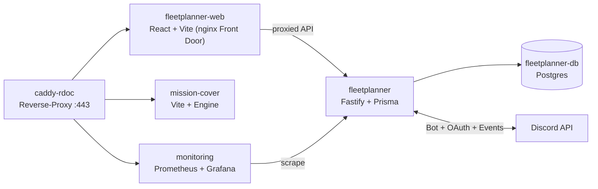

# CLAUDE.md

This file provides guidance to Claude Code (claude.ai/code) when working with code in this repository.

## Projektname

RDOC-Suite — **Fleetplanner** für Star-Citizen-Orgs (Event-/Op-Planung, Discord-Integration).

> **Historie:** Das Repo war ursprünglich eine „Discord Channel Commander Voice Bridge" (RDCC +
> RDOC-RTC + VoiceRelayBots). Der komplette Voice-Stack (`apps/bot`, `apps/bridge`,
> `apps/relay-bots`, LiveKit) wurde entfernt (`dbd2c3f chore: remove legacy voice/CC stack`;
> LiveKit 2026-06-18). Restore-Referenz nur noch als Doku: `docs/LIVEKIT-ARCHIVE-2026-06.md`.
> `apps/companion` (Tauri-Desktop-App) + `packages/shared` wurden 2026-08-07 entfernt — Voice läuft
> über **RDOC-SACompanion / SquadLink** (eigenes Repo, Windows Store; im Fleetplanner nur über die
> `SQUADLINK_*`-Env angebunden).
> **Verwaiste Reste, Löschkandidaten:** `packages/db` + Root-`prisma/` + die
> `pnpm db:*`-Skripte (waren das Bridge/Bot-Schema — kein lebender Consumer mehr).

## Merge-Log zuerst — immer

**Bevor du irgendetwas tust (Code, Config, Docs): füge einen "Queued / Planned Step"-Eintrag (mit `YYYY-MM-DD:`-Prefix) in [`docs/RDOC-SUITE-MERGELOG.md`](docs/RDOC-SUITE-MERGELOG.md) ein.** Keine Ausnahmen. Protokoll:

- **Queued / Planned Step** — Eintrag *vor* der Arbeit schreiben, was geändert wird und warum.
- **Completed Steps** — nach Commit hierher verschieben/kopieren, Commit-Hash anhängen.
- **Open Decisions** — ungeklärte Architekturfragen; entfernen wenn entschieden.

Offene Entscheidungen (Stand 2026-08-07):
1. **Package-Namespace**: ✓ Entschieden — `@rdoc-suite/*` (war `@dccc/*`, umbenannt 2026-05-31).
2. **Voice-Era-Reste löschen?** Teilweise entschieden — `apps/companion` + `packages/shared` sind
   2026-08-07 gelöscht. Offen bleiben `packages/db` + Root-`prisma/` (+ `pnpm db:*`-Skripte).

## Deploy-Regeln — immer einhalten

**RDOC-Suite ≠ DCCC. Zwei verschiedene Server, zwei verschiedene Projekte.**

| Projekt | Server | Pfad | Stack |
|---|---|---|---|
| **RDOC-Suite** | `10.10.10.99` | `/opt/RDOC-Suite` | `docker compose -f docker-compose.prod.yml` |
| **DCCC** | `10.10.10.97` (headwig) | `/opt/discord-channel-commander` | `docker compose -f docker-compose.prod.yml` |

Reverse-Proxy in Prod = **Caddy** (`Caddyfile`, Service `caddy-rdoc`) — nicht Traefik.

**RDOC-Suite Deploy:**
```bash
cd /opt/RDOC-Suite
git pull
docker compose -f docker-compose.prod.yml up -d --build             # alle Services
docker compose -f docker-compose.prod.yml up -d --build fleetplanner      # Backend/API einzeln
docker compose -f docker-compose.prod.yml up -d --build fleetplanner-web   # SPA-Frontend (Nav/UX)
docker compose -f docker-compose.prod.yml logs -f fleetplanner
```

Prod-Services (aus `docker-compose.prod.yml`): `caddy-rdoc`, `fleetplanner`, `fleetplanner-web`,
`fleetplanner-db` (Postgres), `error-page`, `mission-cover`, `monitoring` (Prometheus),
`alertmanager`, `postgres-exporter`, `node-exporter`, `grafana`.

Alle Infra-/Deploy-Informationen liegen in [`docs/`](docs/) — kein STAND.md mehr.

## Discord Bots — NIE verwechseln

Es gibt **nur noch einen** Bot-Typ + die Funkrelais-Bots. Der frühere RDOC-RTC-Voice-Bridge-Bot
(App `1507722962919227452`, `/cc`, Bridge-OAuth) + die Companion-OAuth-App sind entfernt.

| Bot | Env-Vars | Zweck |
|---|---|---|
| **RDOC-Fleetplanner Bot** (Prod App `1509191397264064689`, Portal-Name `RDOC-Fleetplanner`) | `DISCORD_FLEETPLANNER_BOT_TOKEN`, `DISCORD_FLEETPLANNER_CLIENT_ID` | Discord-Events, Feedback-Tickets, DMs, Event-Rollen |
| **Funkrelais Bots** (6×, in `GuildVoiceBot`-Tabelle) | pro Bot eigenes Token, verschlüsselt in DB | „Launch Voice Channels" — jeder Bot joined einen Discord-Voice-Channel |

### Erforderliche Bot-Permissions

**Fleetplanner Bot** — Scopes: `bot applications.commands`
- Permissions: `VIEW_CHANNEL`, `SEND_MESSAGES`, `READ_MESSAGE_HISTORY`, `MANAGE_ROLES`, `MANAGE_EVENTS`
- Intents: `Guilds`, `GuildVoiceStates`

**Token 401 → immer:** Discord Developer Portal → richtige App → Bot → Reset Token → `.env` updaten → Container neu starten.

## Regeln für Claude Code — immer befolgen

1. **Mergelog zuerst, immer.** Vor JEDER Änderung: Queued-Eintrag in `docs/RDOC-SUITE-MERGELOG.md`. Keine Ausnahmen.

2. **RDOC-Suite ≠ DCCC.** Nie verwechseln (siehe Deploy-Regeln oben).

3. **Prod-Zugang NUR über Proxmox-Host → LXC 103.** Niemals direktes `ssh root@10.10.10.99` (User: „fireable offense"). Pfad:
   `ssh -i ~/.ssh/claude_deploy root@ve.raumdock.org "pct exec 103 -- sh -c '<cmd>'"`
   - Key `~/.ssh/claude_deploy` (NICHT die `id_ed25519*`-Defaults). RDOC-Suite liegt in LXC 103 unter `/opt/RDOC-Suite`. Für Befehle `pct exec 103 --` (nicht das interaktive `pct enter`).
   - Deploy macht der User normalerweise selbst; nur deployen wenn explizit beauftragt.

4. **GitHub-Push über gh-Credential-Helper.** Die SSH-Keys authentifizieren NICHT gegen GitHub. `gh` ist als `cccdemon` eingeloggt (https):
   `git -c credential.helper="!gh auth git-credential" push https://github.com/cccdemon/RDOC-Suite.git master`

5. **Kein lokales pnpm/npm/cargo.** Docker baut alles server-seitig. Dockerfile bootstrappt sich selbst.

6. **Code first, compile last.** Ganzes Feature end-to-end schreiben, dann alle Type-Errors in einem Batch fixen.

7. **Docs nur in `docs/`.** Kein STAND.md. Infra-Wahrheit liegt in `docs/RDOC-SUITE-MERGELOG.md` (Code = Ground Truth). Erledigte Handover-/Plan-/Implementation-Log-Docs löschen statt veralten lassen — Historie bleibt im Mergelog.

8. **Zwei Changelogs — immer beide pflegen.**
   - `CHANGELOG.md` (Entwickler) unter `## [Unreleased]` nach jeder Coding-Session — Einträge für alle Änderungen.
   - [`apps/fleetplanner/src/lib/changelog.ts`](apps/fleetplanner/src/lib/changelog.ts) (**Spieler**, sichtbar unter `/handbuch/changelog`) bei jedem user-sichtbaren Feature — kurz, spielerlesbar, EN, neueste zuerst. Kein Git-Log, keine Schema-/Service-Namen.

9. **FeatureRequest-/Plan-Docs:** ein Feature pro File, Dateiname `docs/FR-P<n>-<feature>.md` (n = Prio, 1 höchste … 5 niedrigste). Header: FR-Marker + Prio + **Dependency-Block** (Abhängigkeiten sichtbar machen). In die Planungstabelle unten eintragen.

10. **Regeln in CLAUDE.md schreiben** wenn der User sie nennt — nicht nur in Memory.

## Operative Hinweise für Claude Code

### Häufige Commands — Lokales Dev

```bash
# Installation und Setup
pnpm install

# Fleetplanner hat ein eigenes Prisma-Schema (PostgreSQL in Prod, SQLite lokal)
pnpm --filter @rdoc-suite/fleetplanner db:generate   # nach frischem Clone zwingend
pnpm --filter @rdoc-suite/fleetplanner db:push       # lokal (SQLite, kein Migrations-History)
# Prod: Migrationen laufen automatisch beim Container-Start via entrypoint

# Build / Lint / Format / Test (alle Workspaces)
pnpm build
pnpm lint
pnpm format
pnpm test                   # vitest in jedem Workspace mit test-Skript

# Einzelnes Workspace entwickeln (Watch-Mode)
pnpm --filter @rdoc-suite/fleetplanner dev
pnpm --filter @rdoc-suite/fleetplanner-web dev   # React/Vite SPA (Fleetplanner-Frontend)
pnpm --filter @rdoc-suite/fleetplanner-contracts build  # nach Contract-Änderung, vor SPA-Typecheck
pnpm --filter @rdoc-suite/mission-cover dev

# Einzelne Tests laufen lassen
pnpm --filter @rdoc-suite/fleetplanner test -- <datei>     # nur eine Test-Datei
pnpm --filter @rdoc-suite/fleetplanner test -- -t "name"   # einzelner it("name", ...) Block
```

Es gibt keinen `ts-node`-Runner. **Für Production wird ausschließlich in Docker gebaut** — kein lokaler pnpm/npm/cargo auf dem Server.

> Die Root-`pnpm db:*`-Skripte + Root-`prisma/schema.prisma` gehören zum entfernten Bridge/Bot-Schema
> und sind verwaist. Für Fleetplanner immer die `--filter @rdoc-suite/fleetplanner db:*`-Varianten nutzen.

### Häufige Commands — Production (LXC 103, `/opt/RDOC-Suite`)

Zugang **immer** über Proxmox-Host (siehe Regel 3): `ssh -i ~/.ssh/claude_deploy root@ve.raumdock.org "pct exec 103 -- sh -c '<cmd>'"`. Die folgenden Befehle laufen **innerhalb** LXC 103:

```bash
cd /opt/RDOC-Suite
git pull
docker compose -f docker-compose.prod.yml up -d --build             # alle Services
docker compose -f docker-compose.prod.yml up -d --build fleetplanner      # Backend/API einzeln
docker compose -f docker-compose.prod.yml up -d --build fleetplanner-web   # SPA-Frontend
docker compose -f docker-compose.prod.yml logs -f fleetplanner
```

Build läuft komplett im Container.

### Workspace-Namen

| Verzeichnis | pnpm-Name | Docker-Image | Status |
| --- | --- | --- | --- |
| [apps/fleetplanner/](apps/fleetplanner/) | `@rdoc-suite/fleetplanner` | `rdoc-suite-fleetplanner` | **live** (Backend/API) |
| [apps/fleetplanner-web/](apps/fleetplanner-web/) | `@rdoc-suite/fleetplanner-web` | `rdoc-suite-fleetplanner-web` | **live** (SPA-Frontend) |
| [apps/mission-cover/](apps/mission-cover/) | `@rdoc-suite/mission-cover` | `rdoc-suite-mission-cover` | **live** (Vite-Frontend + Engine) |
| [apps/monitoring/](apps/monitoring/) | — (Prometheus-Image) | `rdoc-suite-monitoring` | **live** |
| [apps/error-page/](apps/error-page/) | — (nginx static) | `rdoc-suite-error-page` | **live** |
| [packages/fleetplanner-contracts/](packages/fleetplanner-contracts/) | `@rdoc-suite/fleetplanner-contracts` | — | **live** (SoT für API-Typen) |
| [packages/db/](packages/db/) | `@rdoc-suite/db` | — | **verwaist** (Bridge/Bot-Schema) |

Prod-Only-Services ohne eigenes TS-Workspace: `alertmanager`, `postgres-exporter`, `node-exporter`, `grafana` (Standard-Images + Config).

### Architektur-Pickup

1. **`apps/fleetplanner` = Fastify + Prisma** (`@rdoc-suite/fleetplanner`). Eigene **PostgreSQL**-DB (`fleetplanner-db` Container); Production unter `suite.raumdock.org/fleetplanner`. Eigene `db:generate`/`db:migrate`-Skripte pro Workspace. Prod-Migrationen laufen automatisch beim Container-Start via entrypoint.

2. **Fleetplanner-Frontend = SPA `fleetplanner-web` (React + Vite).** Die reale Benutzeroberfläche ist die Single-Page-App in [apps/fleetplanner-web/](apps/fleetplanner-web/); ihr **nginx** ([apps/fleetplanner-web/nginx.conf](apps/fleetplanner-web/nginx.conf)) ist die **Front Door** vor `suite.raumdock.org/fleetplanner`, proxied jeden API-Request an das `fleetplanner`-Backend und ist die **eine kanonische Security-Header-Schicht** ([apps/fleetplanner/src/app.ts](apps/fleetplanner/src/app.ts)). Nav-Rail-Modell in [apps/fleetplanner-web/src/nav.ts](apps/fleetplanner-web/src/nav.ts) (`NAV_GROUPS` + `gate`/`auth`). Das SSR in [apps/fleetplanner/src/web/](apps/fleetplanner/src/web/) (`render.ts`/`pages.ts`) existiert noch, ist aber **sekundär** — Nav-/UX-Änderungen fast immer im SPA. Deploy: `docker compose … up -d --build fleetplanner-web` (zusätzlich zu `fleetplanner`).

3. **API-Typen: `@rdoc-suite/fleetplanner-contracts` ist Single Source of Truth.** Zod-Schemas in [packages/fleetplanner-contracts/src/index.ts](packages/fleetplanner-contracts/src/index.ts); Backend (`fleetplanner`) und SPA (`fleetplanner-web`) importieren dieselben Typen (SPA type-only via [apps/fleetplanner-web/src/api/types.ts](apps/fleetplanner-web/src/api/types.ts), damit zod nicht ins Bundle wandert). Neue/erweiterte API-Felder → **zuerst hier**, dann Consumer.

4. **Rollen-Scoping (wichtig):** `User.role` ist **global** — nur `superadmin` lebt dort. Per-Guild-Rollen (`fleetoperator | captain | crew`) leben in `GuildMembership.role`. Middleware: `requireSuperAdmin()` prüft `User.role`; Guild-Aktionen prüfen `GuildMembership.role` für die aktive Guild. Discord-Mapping: `admiralRoleId` → `fleetoperator`, `captainRoleId` → `captain` (aus Guild-Settings). Default bei neuem Member: `crew`.

5. **Funkrelais-Token-Verschlüsselung:** [apps/fleetplanner/src/services/secrets.ts](apps/fleetplanner/src/services/secrets.ts) nutzt `VOICEBOT_ENCRYPTION_KEY` (BYOK, stabil). Fallback auf `SESSION_SECRET` wenn nicht gesetzt — dann müssen die 6 Bot-Tokens nach jeder Session-Secret-Rotation neu eingegeben werden. `VOICEBOT_ENCRYPTION_KEY` NIEMALS ändern ohne alle Bot-Tokens neu einzugeben.

6. **`apps/mission-cover` = Vite-Frontend + Engine** (`@rdoc-suite/mission-cover`). Generiert Mission-Cover-Grafiken; eigenes Volume (`mission_cover_data`). Route: `suite.raumdock.org` (siehe Caddyfile).

7. **`apps/monitoring` = Prometheus-Image.** Keine eigene TypeScript-Quelle; `apps/monitoring/Dockerfile` wraps das offizielle Prometheus-Image mit `apps/monitoring/prometheus.yml`. Ergänzt in Prod durch `alertmanager`, `postgres-exporter`, `node-exporter`, `grafana`. Route: `suite.raumdock.org/monitoring`.

8. **`PUBLIC_BASE_PATH`** (Fleetplanner env): leer (`""`) auf Production (Root-Host). Nur setzen, wenn ein Strip-Proxy mit Path-Prefix verwendet wird. Zod akzeptiert nur `""` oder Werte mit führendem `/`.

Autoritative Env-Referenz: das Zod-Schema in [apps/fleetplanner/src/config/env.ts](apps/fleetplanner/src/config/env.ts) — nicht die `.env`-Templates (beide sind gedriftet, siehe README).

### Quirks, die schon Zeit gekostet haben

- **`pnpm --filter @rdoc-suite/fleetplanner db:generate` muss nach jedem frischen Clone laufen**, bevor gebaut werden kann — sonst löst TypeScript den Prisma-Client als `any` auf → Kaskade von `TS7006`-Fehlern in jedem Prisma-Callback.
- **Discord-IDs immer als String**, nie Number — Snowflakes überschreiten `Number.MAX_SAFE_INTEGER`.
- **Lokales `tsc --noEmit` in `fleetplanner-web` schlägt fehl, wenn `packages/fleetplanner-contracts/dist` veraltet ist.** Die SPA importiert Typen aus dem gebauten `dist`, nicht aus `src` — neue Contract-Felder (z.B. `isStreamEvent`, `streams`) fehlen dann mit `TS2305`/`TS2339`, obwohl der Code korrekt ist. Docker baut Contracts vor der SPA neu → Prod-Build ist grün. Lokal vor Typecheck erst `pnpm --filter @rdoc-suite/fleetplanner-contracts build` laufen lassen (oder die Fehler ignorieren, wenn sie nur Contract-Felder betreffen).
- **pnpm-Workspaces im Runtime-Image: jedes** Workspace-`node_modules/` muss mit-kopiert werden. Vorlage: [apps/fleetplanner/Dockerfile](apps/fleetplanner/Dockerfile).
- **Fleetplanner `__tests__/` aus TSC-Build ausgeschlossen.** `apps/fleetplanner/tsconfig.json` excludet `src/__tests__` — Vitest kompiliert Tests separat. Nie den exclude entfernen, sonst bricht Docker-Build wegen Mock-Typ-Inkompatibilität.
- **`VOICEBOT_ENCRYPTION_KEY` stabil halten.** Fleetplanner verschlüsselt Funkrelais-Bot-Tokens mit diesem Key. Wird er geändert (oder ist nicht gesetzt → Fallback auf `SESSION_SECRET`), müssen alle 6 Bot-Tokens in den Guild-Einstellungen neu eingegeben werden. Key einmal setzen, nie wieder anfassen.
- **"Unsupported state or unable to authenticate data" bei "Launch Voice Channels"** = `VOICEBOT_ENCRYPTION_KEY` hat sich geändert oder fehlt. Fix: alle Funkrelais-Tokens in `/guilds/settings` neu eingeben.

### Wo welche Doku liegt

| Datei | Zweck |
|---|---|
| [docs/RDOC-SUITE-MERGELOG.md](docs/RDOC-SUITE-MERGELOG.md) | **Primäre Quelle** — Queued/Completed/Decisions. Vor jeder Änderung lesen und schreiben. |
| [docs/MERGELOG-archive-pre-2026-06-02.md](docs/MERGELOG-archive-pre-2026-06-02.md) | Archiv (nicht pflegen): topic-basierte Früh-Historie inkl. Tenant-Overhaul + erster Fleetplanner-Feature-Dump. |
| [docs/ROADMAP.md](docs/ROADMAP.md) | **Roadmap-Übersicht** — alle FR-P* mit Prio/Deps/Reihenfolge + Bug-/Feedback-Liste + „needs sighting". Forward-looking (Changelog = Vergangenheit). |
| [docs/FLEETPLANNER-BACKLOG.md](docs/FLEETPLANNER-BACKLOG.md) | Feature-Backlog Fleetplanner — was done, was fehlt. |
| [docs/privacy.md](docs/privacy.md) | Daten-Inventar |
| [README.md](README.md) | Quickstart, Architektur-Diagramm, Repository-Layout |
| [security-plan.md](security-plan.md) | Threat-Model und geplante Härtungen |
| [apps/fleetplanner/prisma/schema.prisma](apps/fleetplanner/prisma/schema.prisma) | Fleetplanner Datenmodell |
| [docs/LIVEKIT-ARCHIVE-2026-06.md](docs/LIVEKIT-ARCHIVE-2026-06.md) | Restore-Referenz für den entfernten Voice-Stack |

Kein STAND.md — alles in `docs/`.

### Planungsdokumente — NOCH NICHT IMPLEMENTIERT

Diese Docs beschreiben genehmigte Pläne, die **nicht im Code sind**. Niemals eigenständig implementieren — nur auf explizite Anweisung.

| Datei | Inhalt | Status |
|---|---|---|
| [docs/archiv/opus-tennant-architecture.md](docs/archiv/opus-tennant-architecture.md) | Op-Visibility (`private/partners/public`) + Guild-Partnerships (`GuildPartnership`-Tabelle) | ✓ **Umgesetzt** — archiviert 2026-06-15, Design-Referenz/Historie |
| [docs/orgmodule-implementationplan.md](docs/orgmodule-implementationplan.md) | Org-Modul: SC-Orgs als First-Class-Entities (`Org`, `OrgMembership`, `OrgInvite`) | Plan, kein Code |
| [docs/archiv/composition-rebuild-plan.md](docs/archiv/composition-rebuild-plan.md) | Composition Board + Leader-Assign + Auto-Match (Schritte 1+2 im Code, Schritte 3-5 offen) | Archiviert 2026-06-15 (Rebuild zurückgestellt) |
| [docs/FR-P1-event-distribution.md](docs/FR-P1-event-distribution.md) | **FeatureRequest, Prio 1.** Event-Distribution: Op-Discord-Event an alle aktiven Partner-Discords cross-posten, Allowlist (`PartnerSharePolicy.autoShare`) + Approval durch alle Fleetoperators des Ziel-Guilds. | ✓ **Umgesetzt** (Phase 1+2, 2026-06-07) |
| [docs/FR-P3-federation-voice.md](docs/FR-P3-federation-voice.md) | **FeatureRequest, Prio 3.** Federation Voice (shared LiveKit room, host+deputies, Cap 16) + Relay-Bots-Multi-Session-Umbau. | ✗ **Abgelehnt** (2026-06-07) |
| [docs/FR-P3-recurring-events.md](docs/FR-P3-recurring-events.md) | **FeatureRequest, Prio 3.** Wiederkehrende Events: RRULE-Template + Scheduler; nativer Discord `recurrence_rule`. Serien-Distribution soft-hängt an FR-P1. | Plan, kein Code |
| [docs/FR-P1-eventcreation-simplification.md](docs/FR-P1-eventcreation-simplification.md) | **FeatureRequest, Prio 1.** Event-Anlage vereinfachen: 2 Views (Mobile-Join + Admin-Wizard). | Plan, kein Code |
| [docs/FR-P2-fleet-import-json.md](docs/FR-P2-fleet-import-json.md) | **FeatureRequest, Prio 2.** Flotten-Import via JSON (CCU-Game-Format) → UserShips. | ✓ Umgesetzt |
| [docs/FR-P2-discord-event-interest.md](docs/FR-P2-discord-event-interest.md) | **FeatureRequest, Prio 2.** Discord-Event-"Interested" → User erscheint im Op automatisch als unassigned. `EventInterest`-Modell, 5-Min-Scheduler. | ✓ Umgesetzt (2026-06-07) |
| [docs/FR-P3-roadmap-tab.md](docs/FR-P3-roadmap-tab.md) | **FeatureRequest, Prio 3.** Roadmap-Tab + Auto-Ingest Discord-Feedback. | Plan, kein Code |
| [docs/FR-P3-language-switch.md](docs/FR-P3-language-switch.md) | **FeatureRequest, Prio 3.** Sprachumschaltung (DE/EN/EN_US/FR/ES), eine Präferenz im User-Profil. | Plan, kein Code (groß/phasenweise) |
| [docs/archiv/FR-P3-org-fleet.md](docs/archiv/FR-P3-org-fleet.md) | **FeatureRequest, Prio 3.** Org-Fleet-Tab: welches Guild-Mitglied welches Schiff hat. | ✓ **Umgesetzt** (2026-06-15, archiviert) |
| [docs/FR-P3-inactivity-alert.md](docs/FR-P3-inactivity-alert.md) | **FeatureRequest, Prio 3.** Member Last-Seen via Gateway-Bot + Alert bei Inaktivität. Braucht GUILD_MEMBERS Intent. | Plan, kein Code |
| [docs/FR-P5-item-database.md](docs/FR-P5-item-database.md) | **FeatureRequest, Prio 5.** Loot-/Item-DB. Blockiert: keine Items-API. | Plan, kein Code |

### Naming & URL-Konventionen

- Public-Interface: `https://suite.raumdock.org`
- Docker-Image-Prefix: `rdoc-suite-<part>`
- `PUBLIC_BASE_PATH` = `""` — kein Path-Prefix irgendwo.
- Reverse-Proxy = Caddy (`Caddyfile`).

### Erforderliche Ports (Production)

| Port | Protokoll | Zweck |
|---|---|---|
| `443` | TCP | HTTPS Reverse-Proxy (Caddy → Fleetplanner, Mission-Cover, Monitoring) |

Die früheren LiveKit-Ports (7880/7881/7882) sind mit dem Voice-Stack entfernt (2026-06-18).

---

## Architektur (Überblick)



---

## Ziel

Fleetplanner: Event-/Op-Planung für Star-Citizen-Orgs mit tiefer Discord-Integration —
Discord-Scheduled-Events ↔ Ops, Rollen-/Rechte-Sync, Feedback-Tickets, Flotten-Import, Roster/
Squad-Planung. Discord-Bot + OAuth2 offiziell; keine User-Tokens, keine Client-Mods.

## Sicherheitsregeln

1. Niemals User-Tokens verwenden.
2. Niemals Discord-Client modifizieren.
3. Berechtigungen werden serverseitig geprüft — clientseitige Checks sind nur UX.
4. Alle API-Inputs mit Zod validieren (an der Boundary).
5. Admins müssen Guild-Features pro Server deaktivieren können.

## Coding Guidelines

- TypeScript strict mode; kein `any` ohne Begründung.
- Alle externen Inputs mit Zod validieren.
- Discord-IDs immer als String behandeln.
- Keine Secrets loggen.
- Keine Businesslogik direkt in Command-Handlern.

## Priorisierte Entscheidung

```
Compliance vor Komfort.
Stabilität vor Hack.
Transparenz vor Magie.
```
</content>
</invoke>
