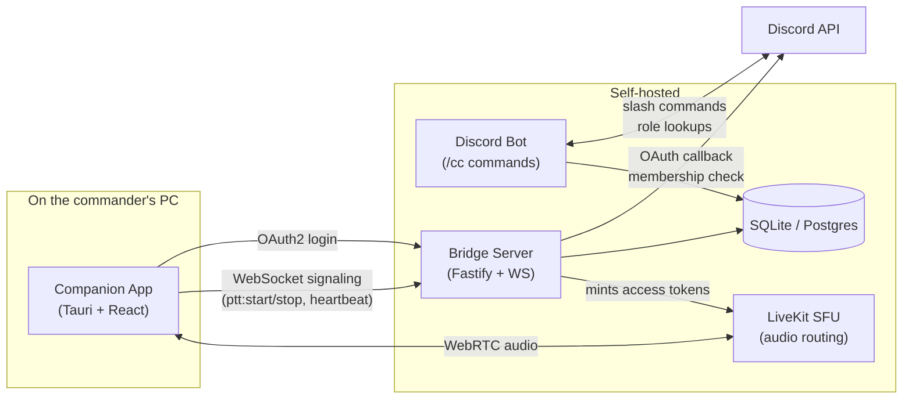

# Discord Channel Commander Voice Bridge

Cross-channel push-to-talk for selected Discord users ("Channel Commanders"), built **without** selfbots, client modifications, or token abuse — fully compliant with Discord's Terms of Service.

## What it does

Multiple teams sit in separate Discord voice channels. Each team has one or more designated **commanders**. When a commander holds their hotkey, they can talk to commanders from **other** voice channels through a side audio bridge — without leaving their own voice channel. When they release, the bridge closes.

```
┌──────────────────┐   ┌──────────────────┐   ┌──────────────────┐
│  Team Alpha      │   │  Team Bravo      │   │  Team Charlie    │
│  Voice Channel   │   │  Voice Channel   │   │  Voice Channel   │
│                  │   │                  │   │                  │
│   Commander A    │   │   Commander B    │   │   Commander C    │
│   (with PTT) ────┼───┼────────┐         │   │                  │
│                  │   │        │         │   │                  │
└──────────────────┘   │        ▼         │   │                  │
                       │  ╔══════════╗    │   │                  │
                       │  ║ Commander║◄───┼───┼── Commander C    │
                       │  ║ Bridge   ║    │   │   (with PTT)     │
                       │  ║ (LiveKit)║    │   │                  │
                       │  ╚══════════╝    │   │                  │
                       └──────────────────┘   └──────────────────┘
```

## Architecture



Three components, each ToS-compliant:

| Component | Role | Stack |
| --- | --- | --- |
| **Bot** ([apps/bot/](apps/bot/)) | Slash commands (`/cc setup`, `/cc role add`, …), permission checks, persists configuration | TypeScript, discord.js |
| **Bridge** ([apps/bridge/](apps/bridge/)) | OAuth2, session tokens, WebSocket signaling, LiveKit room management, periodic permission rechecks | TypeScript, Fastify, jose, livekit-server-sdk |
| **Companion** ([apps/companion/](apps/companion/)) | Global hotkey (keyboard or mouse), Discord login flow, microphone, LiveKit audio client | Tauri (Rust + TypeScript + React) |

Plus a self-hosted **LiveKit** SFU for the actual cross-channel audio.

## Why not just a Discord client plugin?

Modifying the Discord client, using selfbots, or hooking audio out of the Discord process all **violate Discord's Terms of Service**. This project deliberately avoids that path: only the official Bot API and OAuth2 are used, no audio is captured from Discord itself, and the system is fully visible to server admins. See [CLAUDE.md §Wichtige rechtliche und technische Rahmenbedingungen](CLAUDE.md).

## Quickstart (local development)

### 1. Prerequisites

- **Node.js** ≥ 20 LTS
- **pnpm** 10 (`npm i -g pnpm`)
- **Docker Desktop** (for the local LiveKit container)
- **Rust** + **Visual Studio Build Tools** (only to build the Companion app)
  - Windows: `winget install Rustlang.Rustup` and `winget install Microsoft.VisualStudio.2022.BuildTools`

### 2. Install + configure

```bash
git clone https://github.com/head87x/rdcc.git
cd rdcc
pnpm install
cp .env.example .env
# Edit .env and fill in your DISCORD_* values — see docs/admin-guide.md
pnpm db:generate
pnpm db:migrate
```

### 3. Start the supporting services

```bash
docker compose up -d livekit
```

### 4. Run each app in its own terminal

```bash
# Terminal 1 — Bridge
pnpm --filter @dccc/bridge build && node apps/bridge/dist/index.js

# Terminal 2 — Bot (needs DISCORD_BOT_TOKEN + DISCORD_CLIENT_ID in .env)
pnpm --filter @dccc/bot build && node apps/bot/dist/index.js

# Terminal 3 — Companion (live UI, hot-reloads on changes)
pnpm --filter @dccc/companion tauri:dev
```

For a step-by-step admin walkthrough (creating the Discord application, inviting the bot, configuring roles), see [docs/admin-guide.md](docs/admin-guide.md).

For a commander-side walkthrough (sign in, hotkey, audio), see [docs/commander-guide.md](docs/commander-guide.md).

## Repository layout

```
.
├── apps/
│   ├── bot/         # Discord bot (discord.js)
│   ├── bridge/      # Backend server (Fastify + WebSocket + OAuth + LiveKit tokens)
│   └── companion/   # Desktop app (Tauri + React)
├── packages/
│   ├── shared/      # Domain types, WS protocol, Zod validators
│   └── db/          # Prisma client wrapper
├── prisma/          # Database schema + migrations
├── docker-compose.yml
├── CLAUDE.md        # Full design document
├── CHANGELOG.md
└── docs/            # Admin and commander guides
```

## Scripts

| Command | What it does |
| --- | --- |
| `pnpm build` | Builds every workspace package |
| `pnpm test` | Runs every workspace's vitest suite |
| `pnpm lint` | ESLint across all workspaces |
| `pnpm format` | Prettier auto-format |
| `pnpm db:generate` | Generate Prisma client |
| `pnpm db:migrate` | Apply pending migrations |
| `pnpm db:studio` | Open Prisma's web-based DB browser |

## Privacy and security

See [docs/privacy.md](docs/privacy.md) for the data inventory and [CLAUDE.md §Sicherheitsregeln](CLAUDE.md) for the design constraints.

In short:
- **Audio is never persisted** anywhere — neither by the bridge nor by LiveKit (`roomRecord: false`).
- Discord OAuth access tokens are **used once, never logged, never stored**.
- Session tokens are short-lived JWTs (15 min default), revocable.
- Server admins can disable the system per-guild with `/cc disable` at any time.
- All API inputs are Zod-validated at the boundary.

## License

[MIT](LICENSE).
