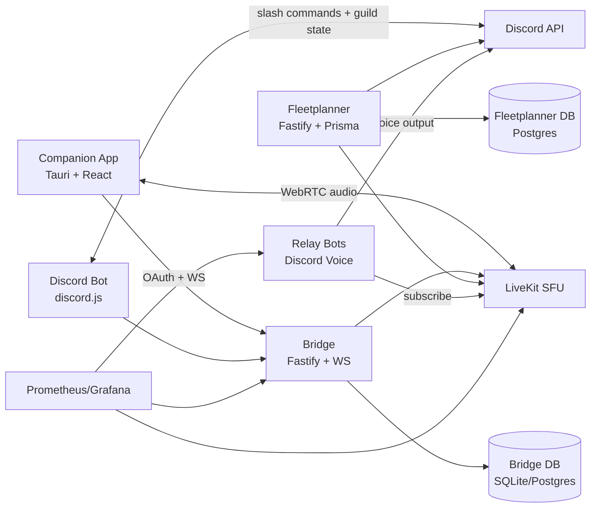

# RDOC-Suite

RDOC-Suite is a self-hosted Discord operations and voice coordination suite. It combines a Discord bot, a backend bridge, a Windows companion push-to-talk app, Fleetplanner, LiveKit voice rooms, Discord relay bots, and monitoring.

The project avoids Discord selfbots, client modifications, and Discord audio capture. It uses Discord's Bot API, OAuth2, and a separate LiveKit audio path.

## What it does

- Lets selected Discord users use cross-channel push-to-talk through the RDOC Squad Link companion app.
- Provides `/cc` Discord commands for server setup, commander roles, allowed voice channels, enable/disable state, and admin access.
- Hosts a bridge backend for OAuth, sessions, WebSocket signaling, LiveKit tokens, downloads, admin UI, relay config, and metrics.
- Provides Fleetplanner for fleet operations, ships, seats, crew assignments, Discord auth, scheduled events, and mission voice sessions.
- Runs optional relay bots that subscribe to LiveKit audio and transmit it into Discord voice channels.
- Provides Prometheus and Grafana configuration for production monitoring.

## Mission role and voice concept

Fleet-level roles and mission roles are separate. A `Superadmin`, `Fleetadmin`, or `Crew` member can have fleet or platform permissions, but does not automatically receive mission voice access.

Mission voice uses two named nets:

- `Command Net`: mission commander voice for mission leaders and commanders.
- `Global Radio Net`: RelayBot broadcast voice into assigned Discord voice channels.

| Scope | Role | Operation lifecycle | Need assignment / unit confirmation | Commanders tab | Command Net | Global Radio Net |
| --- | --- | --- | --- | --- | --- | --- |
| Fleet | Superadmin | Platform/admin scope | Admin scope only | No | No | No |
| Fleet | Fleetadmin | Guild/fleet admin scope | Admin scope only | No | No | No |
| Fleet | Crew | No | No | No | No | No |
| Mission Leader | Event Leader | Yes | Yes | Yes | Yes | Yes |
| Mission Leader | Fleetcommander | No by itself | Yes | No by default | No by default | No by default |
| Mission Leader | Raidleader | Raid leadership | Yes | Yes | Yes | Yes |
| Mission Leader | Wingcommander | Deputy raid leadership | Yes | Yes | Yes | Yes |
| Mission Commander | Ship Captain | No | Own unit context | Yes | Yes | No by default |
| Mission Commander | CQB Captain | No | Own unit context | Yes | Yes | No by default |
| Mission Commander | Added Commander | No | No by default | Yes | Yes | Optional |

Design rules:

- The Commanders tab is a mission roster, not an admin roster.
- Fleet admins are not listed as mission commanders unless they are assigned to that mission role.
- `fleet_commander` manages mission needs and confirms units, but is not automatically on the Command Net.
- `event_leader`, `raid_leader`, and `wing_commander` are voice-bearing leader roles.
- Global Radio Net access is intentionally narrower than Command Net and should be granted only to users who may broadcast through RelayBots.

The detailed voice architecture is documented in `docs/companion-voice-architecture.md`.

## Apps

| App                 | Purpose                                                                                                                                                       |
| ------------------- | ------------------------------------------------------------------------------------------------------------------------------------------------------------- |
| `apps/bot`          | Discord bot for `/cc` setup, roles, channel configuration, admin management, and voice-state pushes.                                                          |
| `apps/bridge`       | Main backend service: OAuth, JWT sessions, WebSockets, LiveKit tokens, admin UI, downloads, relay config, metrics, and internal APIs.                         |
| `apps/companion`    | Tauri + React desktop app, currently Windows-first. Handles login, global hotkeys, microphone/audio devices, LiveKit audio, updates, and mission voice links. |
| `apps/fleetplanner` | Web app for planning operations, ships, seats, crew, guild membership, Discord events, and mission voice sessions.                                            |
| `apps/relay-bots`   | Worker that runs Discord voice bots, subscribes to a LiveKit relay room, and forwards audio into Discord voice channels.                                      |
| `apps/monitoring`   | Prometheus image/config for scraping RDOC-Suite services. Grafana config lives under `deploy/grafana`.                                                        |

## Architecture



## Minimum requirements

These requirements apply to the full production server stack:

- `caddy-rdoc`
- `livekit`
- `bridge`
- `bot`
- `fleetplanner`
- `fleetplanner-db`
- `relay-bots`
- `monitoring` / Prometheus
- Grafana

### Server requirements

| Resource  |                         Minimum |                          Recommended |
| --------- | ------------------------------: | -----------------------------------: |
| CPU       |                          2 vCPU |                               4 vCPU |
| RAM       |                            4 GB |                                 8 GB |
| Disk      |                      20 GB free |                         40-80 GB SSD |
| Bandwidth |               10 Mbps symmetric |                   50+ Mbps symmetric |
| OS        |        Linux x86_64 with Docker |      Ubuntu 22.04/24.04 or Debian 12 |
| Network   | Public IP, HTTPS, UDP reachable | Public IPv4, low latency, stable UDP |

The suite can probably start on **2 vCPU / 4 GB RAM**, but that is the floor. It includes Node services, LiveKit, Postgres, Prometheus, Grafana, Caddy, and Discord relay bots.

For real voice use, **4 vCPU / 8 GB RAM** is the safer baseline.

Disk usage is not only databases. Docker images, build cache, logs, Prometheus metrics, Grafana data, Postgres data, SQLite bridge data, and Companion downloads all consume space.

Do not deploy this on less than **20 GB free**. Use **40 GB+** if the host builds Docker images locally.

### Bandwidth estimate

Voice traffic is the important part. LiveKit forwards Opus audio streams, so bandwidth scales with active speakers and listeners.

```text
egress ~= active_speakers * listeners * 0.08-0.12 Mbps
ingress ~= active_speakers * 0.08-0.12 Mbps
```

| Scenario                    | Approx server bandwidth |
| --------------------------- | ----------------------: |
| 10 users, 1 active speaker  |        ~1 Mbps outbound |
| 20 users, 1 active speaker  |        ~2 Mbps outbound |
| 50 users, 1 active speaker  |        ~5 Mbps outbound |
| 50 users, 2 active speakers |       ~10 Mbps outbound |

Relay bots add more CPU and outbound traffic because they subscribe to LiveKit audio and push it into Discord voice channels.

### Required public ports

| Port       | Purpose                                                |
| ---------- | ------------------------------------------------------ |
| `443/tcp`  | HTTPS reverse proxy for suite UI/API                   |
| `7880/tcp` | LiveKit signaling, usually behind proxy as `wss://...` |
| `7881/tcp` | LiveKit WebRTC TCP                                     |
| `7882/udp` | LiveKit WebRTC UDP, important for good voice quality   |

### Companion client requirements

The Companion app is currently Windows-first. The Tauri/Rust layer contains Windows-specific hotkey and audio handling; mouse hotkeys are Windows-only for now.

| Resource | Minimum                            |
| -------- | ---------------------------------- |
| OS       | Windows 10/11                      |
| CPU      | Any modern dual-core               |
| RAM      | 4 GB                               |
| Network  | Stable internet, Discord reachable |
| Devices  | Microphone + audio output          |

## Local development

### Prerequisites

- Node.js >= 20 LTS
- pnpm 10.33.x
- Docker Desktop or Docker Engine
- Rust + Visual Studio Build Tools, only for `apps/companion`

On Windows for Companion builds:

```powershell
winget install Rustlang.Rustup
winget install Microsoft.VisualStudio.2022.BuildTools
```

### Clone and install

```bash
git clone git@github.com:cccdemon/RDOC-Suite.git
cd RDOC-Suite
pnpm install
cp .env.example .env
```

Edit `.env` before starting the services. At minimum, local bridge/bot login requires:

```text
SESSION_SECRET=32_or_more_random_characters
DISCORD_RDOCRTC_BOT_TOKEN=...
DISCORD_RDOCRTC_CLIENT_ID=...
DISCORD_CLIENT_SECRET=...
OAUTH_REDIRECT_URI=http://localhost:8787/auth/callback
COMPANION_REDIRECT_URI=dccc://auth
LIVEKIT_URL=ws://localhost:7880
LIVEKIT_API_KEY=devkey
LIVEKIT_API_SECRET=secret
```

Fleetplanner also needs a login provider. For Discord login, configure:

```text
DISCORD_CLIENT_ID=...
DISCORD_CLIENT_SECRET=...
DISCORD_FLEETPLANNER_BOT_TOKEN=...
WEB_PUBLIC_URL=http://localhost:3200
```

### Prepare local databases

The bridge/bot use the root Prisma schema. Generate the Prisma client and apply local SQLite migrations:

```bash
pnpm db:generate
pnpm db:migrate
```

Fleetplanner has its own Prisma schema. For local development it defaults to `file:./data/fleetplanner.db` unless `DATABASE_URL` is set:

```bash
pnpm --filter @rdoc-suite/fleetplanner db:generate
pnpm --filter @rdoc-suite/fleetplanner db:push
```

### Start LiveKit

The local compose file only starts LiveKit with dev credentials:

```bash
docker compose up -d livekit
```

### Run services

Use separate terminals:

```bash
# Bridge API/admin UI on http://localhost:8787
pnpm --filter @rdoc-suite/bridge build
node apps/bridge/dist/index.js
```

```bash
# Discord bot
pnpm --filter @rdoc-suite/bot build
node apps/bot/dist/index.js
```

```bash
# Fleetplanner on http://localhost:3200
pnpm --filter @rdoc-suite/fleetplanner dev
```

```bash
# Companion desktop app
pnpm --filter @rdoc-suite/companion tauri:dev
```

Relay bots are optional in local development. They need a config file and Discord bot token/channel setup:

```bash
pnpm --filter @rdoc-suite/relay-bots dev
```

## Production deployment

Production is Docker-first. The server does not need local Node, pnpm, Rust, or Cargo when building/running through Docker.

1. Create `.env` from `.env.example`.
2. Fill in Discord app credentials, secrets, LiveKit credentials, database passwords, domain URLs, and Grafana credentials.
3. Make sure `LIVEKIT_NODE_IP` is set to the host's public IP.
4. Create `data/relay-bots/config.json` if using relay bots. See `apps/relay-bots/config.example.json`.
5. Start the stack:

```bash
docker compose -f docker-compose.prod.yml up -d --build
```

The production compose file runs:

- Caddy reverse proxy
- LiveKit
- Bridge
- Discord bot
- Fleetplanner
- Postgres for Fleetplanner
- Relay bots
- Prometheus
- Grafana

Bridge migrations and Fleetplanner migrations are applied by their container entrypoints on startup.

## Important environment groups

| Group                       | Variables                                                                                                             |
| --------------------------- | --------------------------------------------------------------------------------------------------------------------- |
| Shared                      | `SESSION_SECRET`, `DATABASE_URL`, `LOG_LEVEL`                                                                         |
| Bridge public URLs          | `BRIDGE_SERVER_URL`, `BRIDGE_HOST`, `BRIDGE_PORT`, `OAUTH_REDIRECT_URI`, `COMPANION_REDIRECT_URI`, `PUBLIC_BASE_PATH` |
| RDOC-RTC Discord app        | `DISCORD_RDOCRTC_BOT_TOKEN`, `DISCORD_RDOCRTC_CLIENT_ID`, `DISCORD_RDOCRTC_PUBLIC_KEY`, `DISCORD_CLIENT_SECRET`       |
| LiveKit                     | `LIVEKIT_URL`, `LIVEKIT_API_KEY`, `LIVEKIT_API_SECRET`, `LIVEKIT_NODE_IP`                                             |
| Fleetplanner                | `FLEETPLANNER_DB_PASSWORD`, `FLEETPLANNER_PUBLIC_URL`, `WEB_PUBLIC_URL`, `SUPERADMIN_DISCORD_ID`                      |
| Fleetplanner Discord bot    | `DISCORD_FLEETPLANNER_CLIENT_ID`, `DISCORD_FLEETPLANNER_BOT_TOKEN`                                                    |
| Relay bots                  | `RELAY_LIVEKIT_ROOM`, `RELAY_BOTS_SECRET`, `RELAY_BOTS_ADMIN_URL`, `RELAY_BOTS_ADMIN_SECRET`                          |
| Internal APIs               | `INTERNAL_BRIDGE_SECRET`, `BRIDGE_INTERNAL_URL`, `BRIDGE_FLEET_SECRET`                                                |
| Companion downloads/updates | `GITHUB_REPO`, `GITHUB_TOKEN`, `COMPANION_ASSET_PATTERN`, `COMPANION_UPDATER_PATTERN`                                 |
| Monitoring                  | `GRAFANA_ADMIN_USER`, `GRAFANA_ADMIN_PASSWORD`, `LIVEKIT_PROMETHEUS_URL`                                              |

See `.env.example` for the full list and comments.

## Repository layout

```text
.
|-- apps/
|   |-- bot/           # Discord bot
|   |-- bridge/        # Backend API, admin UI, WebSocket signaling
|   |-- companion/     # Tauri + React desktop client
|   |-- fleetplanner/  # Operations planning web app
|   |-- monitoring/    # Prometheus image/config
|   `-- relay-bots/    # LiveKit-to-Discord voice relay worker
|-- deploy/
|   |-- caddy-rdoc/    # Caddy build/config
|   `-- grafana/       # Grafana provisioning and dashboards
|-- docs/              # Admin, commander, privacy, backlog, handover notes
|-- packages/
|   |-- db/            # Shared Prisma client wrapper for bridge/bot
|   `-- shared/        # Shared protocol/types/validation
|-- prisma/            # Bridge/bot Prisma schema and migrations
|-- docker-compose.yml
|-- docker-compose.prod.yml
|-- livekit.yaml
`-- package.json
```

## Scripts

| Command                                         | What it does                                         |
| ----------------------------------------------- | ---------------------------------------------------- |
| `pnpm build`                                    | Builds every workspace package.                      |
| `pnpm test`                                     | Runs every workspace test suite that defines `test`. |
| `pnpm lint`                                     | Runs ESLint across the repo.                         |
| `pnpm format`                                   | Formats the repo with Prettier.                      |
| `pnpm format:check`                             | Checks formatting without writing changes.           |
| `pnpm db:generate`                              | Generates the root Prisma client for bridge/bot.     |
| `pnpm db:migrate`                               | Applies root Prisma migrations locally.              |
| `pnpm db:studio`                                | Opens Prisma Studio for the root database.           |
| `pnpm --filter @rdoc-suite/bridge test`         | Runs bridge tests.                                   |
| `pnpm --filter @rdoc-suite/fleetplanner test`   | Runs Fleetplanner tests.                             |
| `pnpm --filter @rdoc-suite/companion tauri:dev` | Starts the Companion desktop app in dev mode.        |

## Documentation

- Admin walkthrough: [docs/admin-guide.md](docs/admin-guide.md)
- Commander walkthrough: [docs/commander-guide.md](docs/commander-guide.md)
- Privacy/data inventory: [docs/privacy.md](docs/privacy.md)
- Design and implementation notes: [CLAUDE.md](CLAUDE.md)
- Fleetplanner backlog: [docs/FLEETPLANNER-BACKLOG.md](docs/FLEETPLANNER-BACKLOG.md)

## Privacy and security

- Audio is not persisted by the bridge or LiveKit (`roomRecord: false`).
- Discord OAuth access tokens are used for login and are not stored as long-term credentials.
- Session tokens are JWTs and can be expired/revoked by deployment policy.
- Server admins can disable Channel Commander per guild.
- API inputs are validated at service boundaries with Zod.
- Relay bot credentials and service secrets belong in `.env` or mounted config, not in git.

## License

Source-available for non-commercial use under the PolyForm Noncommercial License 1.0.0.

Commercial use, paid hosting, resale, SaaS operation, or use as part of a commercial product or service requires prior written permission from the authors.

The RDOC-Suite credit banner/stamp must remain visible in public deployments and redistributed versions unless the authors grant written permission to remove or alter it.

Authors:

- xheadwigx: https://github.com/cccdemon
- justcallmedeimos: https://twitch.tv/justcallmedeimos

See [LICENSE](LICENSE).
See [NOTICE](NOTICE) and [BRANDING.md](BRANDING.md) for required attribution and brand notice terms.
