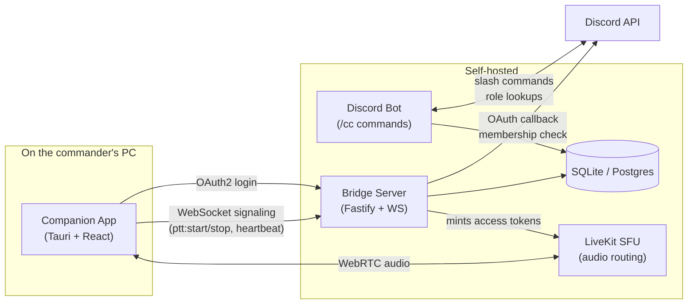

# Discord Channel Commander Voice Bridge

Cross-channel push-to-talk for selected Discord users ("Channel Commanders"), built **without** selfbots, client modifications, or token abuse — fully compliant with Discord's Terms of Service.

## What it does

Multiple teams sit in separate Discord voice channels. Each team has one or more designated **commanders**. When a commander holds their hotkey, they can talk to commanders from **other** voice channels through a side audio bridge — without leaving their own voice channel. When they release, the bridge closes.

```
┌──────────────────┐   ┌──────────────────┐   ┌──────────────────┐
│  Team Alpha      │   │  Team Bravo      │   │  Team Charlie    │
│  Voice Channel   │   │  Voice Channel   │   │  Voice Channel   │
│                  │   │                  │   │                  │
│   Commander A    │   │   Commander B    │   │   Commander C    │
│   (with PTT) ────┼───┼────────┐         │   │                  │
│                  │   │        │         │   │                  │
└──────────────────┘   │        ▼         │   │                  │
                       │  ╔══════════╗    │   │                  │
                       │  ║ Commander║◄───┼───┼── Commander C    │
                       │  ║ Bridge   ║    │   │   (with PTT)     │
                       │  ║ (LiveKit)║    │   │                  │
                       │  ╚══════════╝    │   │                  │
                       └──────────────────┘   └──────────────────┘
```

## Architecture



Three components, each ToS-compliant:

| Component | Role | Stack |
| --- | --- | --- |
| **Bot** ([apps/bot/](apps/bot/)) | Slash commands (`/cc setup`, `/cc role add`, …), permission checks, persists configuration | TypeScript, discord.js |
| **Bridge** ([apps/bridge/](apps/bridge/)) | OAuth2, session tokens, WebSocket signaling, LiveKit room management, periodic permission rechecks | TypeScript, Fastify, jose, livekit-server-sdk |
| **Companion** ([apps/companion/](apps/companion/)) | Global hotkey (keyboard or mouse), Discord login flow, microphone, LiveKit audio client | Tauri (Rust + TypeScript + React) |

Plus a self-hosted **LiveKit** SFU for the actual cross-channel audio.

## Why not just a Discord client plugin?

Modifying the Discord client, using selfbots, or hooking audio out of the Discord process all **violate Discord's Terms of Service**. This project deliberately avoids that path: only the official Bot API and OAuth2 are used, no audio is captured from Discord itself, and the system is fully visible to server admins. See [CLAUDE.md §Wichtige rechtliche und technische Rahmenbedingungen](CLAUDE.md).

## Minimum requirements

These requirements apply to the full server stack:

- `caddy-rdoc`
- `livekit`
- `bridge`
- `bot`
- `fleetplanner`
- `fleetplanner-db`
- `relay-bots`
- `monitoring` / Prometheus
- Grafana

### Server requirements

| Resource | Minimum | Recommended |
| --- | ---: | ---: |
| CPU | 2 vCPU | 4 vCPU |
| RAM | 4 GB | 8 GB |
| Disk | 20 GB free | 40-80 GB SSD |
| Bandwidth | 10 Mbps symmetric | 50+ Mbps symmetric |
| OS | Linux x86_64 with Docker | Ubuntu 22.04/24.04 or Debian 12 |
| Network | Public IP, HTTPS, UDP reachable | Public IPv4, low latency, stable UDP |

The suite can probably start on **2 vCPU / 4 GB RAM**, but that is the floor. It includes Node services, LiveKit, Postgres, Prometheus, Grafana, Caddy, and Discord relay bots.

For real voice use, **4 vCPU / 8 GB RAM** is the safer baseline.

Disk usage is not only databases. Docker images, build cache, logs, Prometheus metrics, Grafana data, Postgres data, SQLite bridge data, and Companion downloads all consume space.

Do not deploy this on less than **20 GB free**. Use **40 GB+** if the host builds Docker images locally.

### Bandwidth estimate

Voice traffic is the important part. LiveKit forwards Opus audio streams, so bandwidth scales with active speakers and listeners.

```text
egress ~= active_speakers * listeners * 0.08-0.12 Mbps
ingress ~= active_speakers * 0.08-0.12 Mbps
```

| Scenario | Approx server bandwidth |
| --- | ---: |
| 10 users, 1 active speaker | ~1 Mbps outbound |
| 20 users, 1 active speaker | ~2 Mbps outbound |
| 50 users, 1 active speaker | ~5 Mbps outbound |
| 50 users, 2 active speakers | ~10 Mbps outbound |

Relay bots add more CPU and outbound traffic because they subscribe to LiveKit audio and push it into Discord voice channels.

### Required server OS / runtime

Server side should run on:

```text
Linux x86_64
Docker Engine + Docker Compose plugin
Public HTTPS reverse proxy
Reachable LiveKit WebRTC ports
```

Production is Docker-first. The server does **not** need local Node, pnpm, Rust, or Cargo if you build and run through Docker.

### Required public ports

| Port | Purpose |
| --- | --- |
| `443/tcp` | HTTPS reverse proxy for suite UI/API |
| `7880/tcp` | LiveKit signaling, usually behind proxy as `wss://...` |
| `7881/tcp` | LiveKit WebRTC TCP |
| `7882/udp` | LiveKit WebRTC UDP, important for good voice quality |

### Companion client requirements

The Companion app is effectively **Windows-first right now**. The Tauri/Rust config has Windows-specific hotkey/audio handling, and mouse hotkeys are Windows-only for now.

| Resource | Minimum |
| --- | --- |
| OS | Windows 10/11 |
| CPU | Any modern dual-core |
| RAM | 4 GB |
| Network | Stable internet, Discord reachable |
| Devices | Microphone + audio output |

### Recommended deployment

For a small RDOC deployment, use:

```text
4 vCPU
8 GB RAM
60 GB SSD
Ubuntu 24.04 LTS or Debian 12
50 Mbps symmetric bandwidth
Public IPv4
Docker Engine + Compose
```

This gives enough headroom for LiveKit voice, relay bots, monitoring, builds, logs, and future growth.

## Quickstart (local development)

### 1. Prerequisites

- **Node.js** ≥ 20 LTS
- **pnpm** 10 (`npm i -g pnpm`)
- **Docker Desktop** (for the local LiveKit container)
- **Rust** + **Visual Studio Build Tools** (only to build the Companion app)
  - Windows: `winget install Rustlang.Rustup` and `winget install Microsoft.VisualStudio.2022.BuildTools`

### 2. Install + configure

```bash
git clone https://github.com/head87x/rdcc.git
cd rdcc
pnpm install
cp .env.example .env
# Edit .env and fill in your DISCORD_* values — see docs/admin-guide.md
pnpm db:generate
pnpm db:migrate
```

### 3. Start the supporting services

```bash
docker compose up -d livekit
```

### 4. Run each app in its own terminal

```bash
# Terminal 1 — Bridge
pnpm --filter @rdoc-suite/bridge build && node apps/bridge/dist/index.js

# Terminal 2 — Bot (needs DISCORD_BOT_TOKEN + DISCORD_CLIENT_ID in .env)
pnpm --filter @rdoc-suite/bot build && node apps/bot/dist/index.js

# Terminal 3 — Companion (live UI, hot-reloads on changes)
pnpm --filter @rdoc-suite/companion tauri:dev
```

For a step-by-step admin walkthrough (creating the Discord application, inviting the bot, configuring roles), see [docs/admin-guide.md](docs/admin-guide.md).

For a commander-side walkthrough (sign in, hotkey, audio), see [docs/commander-guide.md](docs/commander-guide.md).

## Repository layout

```
.
├── apps/
│   ├── bot/         # Discord bot (discord.js)
│   ├── bridge/      # Backend server (Fastify + WebSocket + OAuth + LiveKit tokens)
│   └── companion/   # Desktop app (Tauri + React)
├── packages/
│   ├── shared/      # Domain types, WS protocol, Zod validators
│   └── db/          # Prisma client wrapper
├── prisma/          # Database schema + migrations
├── docker-compose.yml
├── CLAUDE.md        # Full design document
├── CHANGELOG.md
└── docs/            # Admin and commander guides
```

## Scripts

| Command | What it does |
| --- | --- |
| `pnpm build` | Builds every workspace package |
| `pnpm test` | Runs every workspace's vitest suite |
| `pnpm lint` | ESLint across all workspaces |
| `pnpm format` | Prettier auto-format |
| `pnpm db:generate` | Generate Prisma client |
| `pnpm db:migrate` | Apply pending migrations |
| `pnpm db:studio` | Open Prisma's web-based DB browser |

## Privacy and security

See [docs/privacy.md](docs/privacy.md) for the data inventory and [CLAUDE.md §Sicherheitsregeln](CLAUDE.md) for the design constraints.

In short:
- **Audio is never persisted** anywhere — neither by the bridge nor by LiveKit (`roomRecord: false`).
- Discord OAuth access tokens are **used once, never logged, never stored**.
- Session tokens are short-lived JWTs (15 min default), revocable.
- Server admins can disable the system per-guild with `/cc disable` at any time.
- All API inputs are Zod-validated at the boundary.

## License

[MIT](LICENSE).
