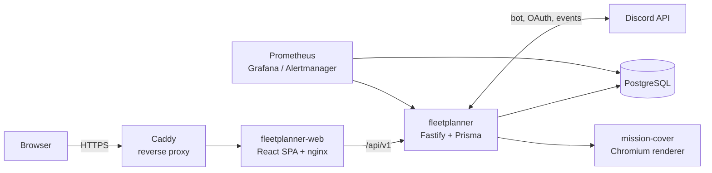

# RDOC-Suite

RDOC-Suite is a self-hosted fleet operations planner for Star Citizen orgs that run on Discord. Members sign up for an operation, offer ships, take seats, and the fleet operator builds the roster: ships, fighter squadrons, ground vehicles and CQB troops, grouped into formations and staffed down to the individual slot.

It integrates with Discord through the official Bot API and OAuth2 only — no selfbots, no client modifications, no audio capture.

> **Voice is gone.** Earlier versions shipped a cross-channel push-to-talk stack (Discord bot with `/cc` commands, a bridge backend, LiveKit SFU and Discord relay bots). That stack was removed in `dbd2c3f`; LiveKit followed on 2026-06-18. The archives are in [docs/VOICE-ARCHIVE-2026-06.md](docs/VOICE-ARCHIVE-2026-06.md) and [docs/LIVEKIT-ARCHIVE-2026-06.md](docs/LIVEKIT-ARCHIVE-2026-06.md).

## What it does

**Operations**

- Plan an operation with a structured set of needs: ships (by type), fighter squadrons, and CQB teams of a given size.
- Members offer ships from a synced Star Citizen ship catalogue or from their own hangar; the fleet operator accepts or rejects each offer.
- Crew claim seats on accepted ships, or sign up flexibly and let the operator place them.
- Group units into formations, nest squadrons and troops beneath them, and load vehicles and fighters into carrier ships.
- The first place in a ship, squadron or troop is always the Captain; the operator can hand that role to anyone.
- Late arrivals carry an ETA so the operator can plan around them.
- Every roster change is recorded in a per-operation mission log, visible to participants.

**Discord**

- Discord OAuth login; guild membership and roles map to fleet operator / captain / crew per guild.
- Operations publish as Discord scheduled events. Clicking "Interested" there enrolls the pilot in the operation automatically, even before their first login.
- Cross-post operations to partner orgs' Discords, with per-partner auto-share or an approval inbox.
- Feedback tickets and DMs through the Fleetplanner bot.

**Around it**

- Mission cover images rendered server-side for operation banners.
- Polls, streams, recurring operations, an org fleet roster, JSON fleet import, and a roadmap page.
- Prometheus, Alertmanager and Grafana for production monitoring.

## Apps

| App                     | Purpose                                                                                                             |
| ----------------------- | ------------------------------------------------------------------------------------------------------------------- |
| `apps/fleetplanner`     | Backend: Fastify + Prisma (PostgreSQL). REST API under `/api/v1`, Discord bot, schedulers, and a secondary SSR layer. |
| `apps/fleetplanner-web` | The actual user interface: React + Vite SPA. Its nginx is the front door and proxies every API request to the backend. |
| `apps/mission-cover`    | Render microservice for operation cover images (headless Chromium). Engine by **Vi5E**.                              |
| `apps/error-page`       | Static nginx error page served by the reverse proxy when a service is down.                                          |
| `apps/monitoring`       | Prometheus image plus scrape config. Grafana and Alertmanager config live under `deploy/`.                           |
| `apps/companion`        | **Dormant.** Tauri desktop app from the voice era. Its backends (bridge, LiveKit) no longer exist, so it does not currently function. Kept for reference. |

| Package                          | Purpose                                                                                       |
| -------------------------------- | ----------------------------------------------------------------------------------------------- |
| `packages/fleetplanner-contracts` | Zod schemas for the API. **Single source of truth** — backend and SPA import the same types. |
| `packages/shared`                | Shared types and validation helpers.                                                            |
| `packages/db`                    | Prisma client wrapper. Belongs to the removed bridge/bot schema; effectively vestigial.         |

## Architecture



`fleetplanner-web`'s nginx is the single canonical security-header layer in front of the backend.

## Requirements

### Server

| Resource  |                  Minimum |                     Recommended |
| --------- | -----------------------: | ------------------------------: |
| CPU       |                   2 vCPU |                          4 vCPU |
| RAM       |                     2 GB |                            4 GB |
| Disk      |               20 GB free |                    40 GB+ SSD   |
| OS        | Linux x86_64 with Docker | Ubuntu 22.04/24.04 or Debian 12 |
| Network   |         Public IP, HTTPS |                     Public IPv4 |

There is no real-time media path any more, so the load is Node services, PostgreSQL and the monitoring stack. Mission-cover renders with headless Chromium and is the one memory spike worth planning for.

Disk is not only the database: Docker images, build cache, logs, Prometheus metrics, Grafana data and rendered covers all consume space. Use 40 GB+ if the host builds images locally.

### Ports

| Port      | Purpose                              |
| --------- | ------------------------------------ |
| `443/tcp` | HTTPS reverse proxy for the whole UI |

That is the only port that needs to be public.

## Local development

### Prerequisites

- Node.js >= 20 LTS
- pnpm 10.33.x
- Docker (for a local PostgreSQL, or use SQLite)

### Setup

```bash
git clone git@github.com:cccdemon/RDOC-Suite.git
cd RDOC-Suite
pnpm install
cp .env.example .env
```

Fleetplanner needs Discord credentials to log anyone in. At minimum:

```text
SESSION_SECRET=32_or_more_random_characters
DISCORD_CLIENT_ID=...
DISCORD_CLIENT_SECRET=...
DISCORD_FLEETPLANNER_BOT_TOKEN=...
WEB_PUBLIC_URL=http://localhost:3200
```

### Database

Fleetplanner owns its Prisma schema in `apps/fleetplanner/prisma`. Locally it defaults to SQLite unless `DATABASE_URL` points elsewhere:

```bash
pnpm --filter @rdoc-suite/fleetplanner db:generate   # required after every fresh clone
pnpm --filter @rdoc-suite/fleetplanner db:push       # local schema sync, no migration history
```

`db:generate` is not optional. Without the generated client, TypeScript resolves every Prisma call as `any` and the build collapses into a cascade of `TS7006` errors.

In production, migrations run automatically from the container entrypoint.

### Run

```bash
pnpm --filter @rdoc-suite/fleetplanner dev       # API on http://localhost:3200
pnpm --filter @rdoc-suite/fleetplanner-web dev   # SPA (Vite dev server)
```

After changing anything in `packages/fleetplanner-contracts`, rebuild it before type-checking the SPA — the SPA imports the built `dist`, not `src`:

```bash
pnpm --filter @rdoc-suite/fleetplanner-contracts build
```

## Production deployment

Production is Docker-first. The server needs no local Node, pnpm or Rust — everything builds inside the containers.

1. Create `.env` from [`.env.prod.template`](.env.prod.template).
2. Fill in Discord credentials, secrets, the database password and the public URLs.
3. Start the stack:

```bash
docker compose -f docker-compose.prod.yml up -d --build

# or a single service
docker compose -f docker-compose.prod.yml up -d --build fleetplanner
docker compose -f docker-compose.prod.yml up -d --build fleetplanner-web
docker compose -f docker-compose.prod.yml logs -f fleetplanner
```

The production compose file runs:

| Service            | Role                                     |
| ------------------ | ---------------------------------------- |
| `caddy-rdoc`       | TLS reverse proxy                        |
| `fleetplanner-web` | SPA + nginx front door                   |
| `fleetplanner`     | API, Discord bot, schedulers             |
| `fleetplanner-db`  | PostgreSQL                               |
| `mission-cover`    | Cover renderer                           |
| `error-page`       | Fallback page                            |
| `monitoring`       | Prometheus                               |
| `alertmanager`     | Alert routing                            |
| `postgres-exporter`, `node-exporter` | Metrics exporters      |
| `grafana`          | Dashboards                               |

Fleetplanner applies its Prisma migrations on container start.

## Environment

| Group         | Variables                                                                                     |
| ------------- | --------------------------------------------------------------------------------------------- |
| Core          | `SESSION_SECRET`, `DATABASE_URL`, `NODE_ENV`, `LOG_LEVEL`, `PUBLIC_BASE_PATH`, `PORT`, `HOST`, `TRUST_PROXY` |
| Database      | `FLEETPLANNER_DB_PASSWORD` (compose, PostgreSQL container)                                     |
| Discord       | `DISCORD_CLIENT_ID`, `DISCORD_CLIENT_SECRET`, `DISCORD_FLEETPLANNER_CLIENT_ID`, `DISCORD_FLEETPLANNER_BOT_TOKEN`, `DISCORD_FLEETPLANNER_PUBLIC_KEY` |
| URLs          | `WEB_PUBLIC_URL`, `FLEETPLANNER_PUBLIC_URL`, `OAUTH_REDIRECT_URI`                              |
| Bootstrap     | `SUPERADMIN_DISCORD_ID`, `SUPERADMIN_CONTACT`                                                  |
| Encryption    | `VOICEBOT_ENCRYPTION_KEY` — encrypts stored Discord voice-bot tokens. **Set once, never change it**, or every stored token has to be re-entered. |
| Mission cover | `MISSIONCOVER_SERVICE_SECRET`, `MISSIONCOVER_SERVICE_URL`, `MISSIONCOVER_PUBLIC_URL`           |
| Monitoring    | `GRAFANA_ADMIN_USER`, `GRAFANA_ADMIN_PASSWORD`                                                 |
| Optional      | `MAINTENANCE_MODE`, alternative login providers (`GITHUB_*`, `GOOGLE_*`)                       |

The authoritative list is the Zod schema in [`apps/fleetplanner/src/config/env.ts`](apps/fleetplanner/src/config/env.ts) — it validates at startup and will reject a bad config.

Both `.env` templates have drifted and should be treated as incomplete: [`.env.example`](.env.example) is missing `DISCORD_CLIENT_ID`, `WEB_PUBLIC_URL`, `SUPERADMIN_DISCORD_ID` and `VOICEBOT_ENCRYPTION_KEY`, and [`.env.prod.template`](.env.prod.template) still carries `BRIDGE_*` and `RELAY_BOTS_*` keys for services that no longer exist.

## Repository layout

```text
.
|-- apps/
|   |-- companion/        # dormant desktop app from the voice era
|   |-- error-page/       # static nginx error page
|   |-- fleetplanner/     # backend: API, Discord bot, schedulers, SSR
|   |-- fleetplanner-web/ # React SPA + nginx front door  <- the real UI
|   |-- mission-cover/    # cover render microservice
|   `-- monitoring/       # Prometheus image + scrape config
|-- deploy/
|   |-- alertmanager/
|   |-- caddy-rdoc/
|   `-- grafana/
|-- docs/                 # merge log, roadmap, feature requests, privacy
|-- packages/
|   |-- db/               # Prisma wrapper (vestigial, see above)
|   |-- fleetplanner-contracts/  # Zod API contracts — source of truth
|   `-- shared/           # shared types + validation
|-- prisma/               # schema of the removed bridge/bot stack (vestigial)
|-- docker-compose.prod.yml
`-- package.json
```

The root `prisma/` directory and the root `pnpm db:generate` / `db:migrate` / `db:studio` scripts belong to the removed bridge/bot services. Fleetplanner uses its own schema and its own scripts; use the `--filter @rdoc-suite/fleetplanner` variants.

## Scripts

| Command                                                    | What it does                                    |
| ---------------------------------------------------------- | ----------------------------------------------- |
| `pnpm build`                                               | Builds every workspace package.                 |
| `pnpm test`                                                | Runs every workspace test suite.                |
| `pnpm lint`                                                | Runs ESLint across the repo.                     |
| `pnpm format` / `pnpm format:check`                        | Prettier write / check.                          |
| `pnpm --filter @rdoc-suite/fleetplanner dev`               | Backend in watch mode.                           |
| `pnpm --filter @rdoc-suite/fleetplanner test`              | Backend tests.                                   |
| `pnpm --filter @rdoc-suite/fleetplanner db:generate`       | Generates the Fleetplanner Prisma client.        |
| `pnpm --filter @rdoc-suite/fleetplanner-web dev`           | SPA dev server.                                  |
| `pnpm --filter @rdoc-suite/fleetplanner-contracts build`   | Rebuilds the API contracts.                      |

## Documentation

| File                                                             | Contents                                                   |
| ---------------------------------------------------------------- | ---------------------------------------------------------- |
| [docs/RDOC-SUITE-MERGELOG.md](docs/RDOC-SUITE-MERGELOG.md)       | **Primary source.** Queued, completed and open decisions.  |
| [docs/ROADMAP.md](docs/ROADMAP.md)                               | Planned features with priorities and dependencies.         |
| [CHANGELOG.md](CHANGELOG.md)                                     | Developer changelog.                                       |
| [docs/FLEETPLANNER-BACKLOG.md](docs/FLEETPLANNER-BACKLOG.md)     | Feature backlog.                                           |
| [docs/privacy.md](docs/privacy.md)                               | Data inventory.                                            |
| [security-plan.md](security-plan.md)                             | Threat model and hardening.                                |
| [CLAUDE.md](CLAUDE.md)                                           | Working rules and architecture notes for contributors.     |

The player-facing changelog lives in `apps/fleetplanner/src/lib/changelog.ts` and is published at `/handbuch/changelog`.

## Privacy and security

- Discord OAuth tokens are used for login and are not kept as long-term credentials.
- Discord IDs are always handled as strings — snowflakes exceed `Number.MAX_SAFE_INTEGER`.
- All external input is validated with Zod at the service boundary.
- Anonymous viewers of a public operation never see member identities or the mission log.
- Server admins can disable the integration per guild.
- Secrets belong in `.env` or mounted config, never in git.

## License

Source-available for non-commercial use under the PolyForm Noncommercial License 1.0.0.

Commercial use, paid hosting, resale, SaaS operation, or use as part of a commercial product or service requires prior written permission from the authors.

The RDOC-Suite credit banner/stamp must remain visible in public deployments and redistributed versions unless the authors grant written permission to remove or alter it.

Authors:

- xheadwigx: https://github.com/cccdemon
- justcallmedeimos: https://twitch.tv/justcallmedeimos

See [LICENSE](LICENSE).
See [NOTICE](NOTICE) and [BRANDING.md](BRANDING.md) for required attribution and brand notice terms.
