# Softwarearchitektur — RDOC Fleetplanner

Stand 2026-08-22. Quelle ist der Code, nicht die Erinnerung: Entitäten aus
[`prisma/schema.prisma`](../apps/fleetplanner/prisma/schema.prisma), Abläufe aus den Routen und
Services. Wo Doku und Code auseinanderlaufen, gewinnt der Code — Abweichungen stehen in
[§10](#10-altlasten-und-bekannte-abweichungen).

Kurzfassung für Leser: [§1](#1-kontext) sagt, was das System ist. [§4](#4-modulinventar) sagt, wo
welcher Code liegt. [§6](#6-datenmodell) ist das Datenmodell. [§7](#7-programmablaufpläne) sind die
Abläufe.

---

## 1. Kontext

Der Fleetplanner plant Star-Citizen-Operationen für Discord-Organisationen: Termin, Flottenbedarf,
Sitzplätze, Anmeldung, Voice. Jede Operation erscheint als Discord-Event; die Discord-Rollen einer
Guild bestimmen, wer im Fleetplanner was darf.

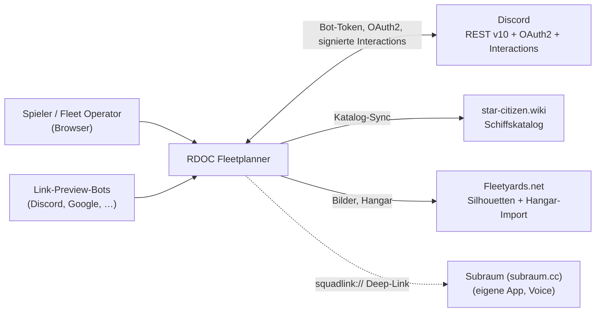

**Mandantenmodell:** ein Mandant = eine Discord-Guild. Jede Operation, jede Umfrage und jedes
Template gehört genau einer Guild (`Operation.guildId`). Es gibt keine mandantenfreie Ressource
außer dem globalen Schiffs-/Ortskatalog und den Instanz-Einstellungen.

**Nicht-Ziele.** Kein User-Token, kein modifizierter Discord-Client, kein Gateway-Bot: der
Fleetplanner spricht Discord ausschließlich über REST mit Bot-Token plus signierte HTTP-Interactions.
Das ist der Grund, warum „Interessiert" gepollt statt empfangen wird ([§7.5](#75-interest-sync)).

---

## 2. Laufzeitsicht (Container)

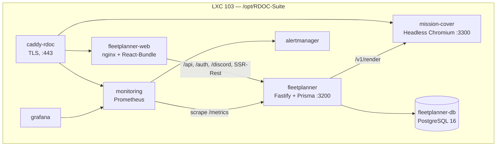

Zwei Dinge daran sind nicht offensichtlich:

1. **nginx ist die Haustür, nicht nur ein Asset-Server.** [`nginx.conf`](../apps/fleetplanner-web/nginx.conf)
   entscheidet pro Pfad zwischen SPA-Dokument, statischem Asset und Backend-Proxy — und ist die
   **einzige** Stelle, die Security-Header setzt. Das Backend setzt keine, weil beide Schichten
   zusammen doppelte und widersprüchliche Header erzeugt hatten.
2. **Der User-Agent entscheidet über die Antwort.** Auf `/`, `/ops/:id`, `/polls/:id`, `/handbuch/*`
   und `/rechtliches/*` liefert nginx Crawlern das indexierbare HTML des Backends und Menschen die
   SPA. Deshalb rendert das Backend noch HTML, obwohl die Anwendung API-only ist.

Die Proxy-Kette ist auch eine Vertrauenskette: `TRUST_PROXY` legt fest, wessen `X-Forwarded-For`
Fastify glaubt. Zu weit gefasst heißt: Clients fälschen ihre IP und hebeln die Rate-Limits aus.

---

## 3. Schichtenmodell Backend

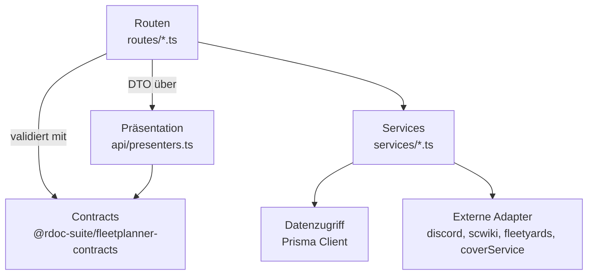

Regeln, die diese Schichtung trägt:

- **Validierung an der Grenze.** Jeder externe Input geht durch ein Zod-Schema aus dem
  Contracts-Paket. Eine Route, die `req.body` direkt liest, ist ein Fehler.
- **Services kennen kein HTTP.** Kein `FastifyRequest`, kein Statuscode. Ein Service gibt ein
  Ergebnisobjekt zurück (`{ ok: false, reason: "already_partners" }`), die Route übersetzt es in
  Status und Meldung. Das ist der Grund, warum Services im Unit-Test ohne Server prüfbar sind.
- **Präsentation ist eine eigene Schicht.** `presenters.ts` mappt Prisma-Zeilen auf DTOs und
  entscheidet, was ein anonymer Betrachter *nicht* sieht. Datenbankspalten gehen nie roh nach außen.

---

## 4. Modulinventar

### 4.1 Backend `apps/fleetplanner`

| Verzeichnis | Inhalt | Anmerkung |
|---|---|---|
| `routes/apiV1.ts` | `/api/v1` — **der** API-Layer | ~3.260 Zeilen, 121 Routen; der ältere Form-POST-Layer `routes/api.ts` ist 2026-08-22 entfallen |
| `routes/auth.ts` | OAuth-Start/Callback, Discord-Verknüpfung, Logout | 3 Provider: Discord, GitHub, Google |
| `routes/guilds.ts` | Bot-Installation, Guild-Callback, Diagnose | |
| `routes/web.ts` | Crawler-HTML, `calendar.ics`, `participants.csv`, Asset-Proxy | einzige HTML-Ausgabe |
| `routes/discordInteractions.ts` | `POST /discord/interactions` | Ed25519-Prüfung vor jeder Verarbeitung |
| `routes/cover.ts` | Rücksprung des Cover-Editors | nur Redirect |
| `routes/e2eAuth.ts` | Test-Seam | **existiert nur mit gesetztem `E2E_TEST_LOGIN_SECRET`** |
| `api/openapi.ts` | Pfade + Schema-Registry | speist `/api/v1/openapi.json`; die Swagger-UI selbst rendert die SPA unter `/api-docs` |
| `api/presenters.ts` | DTO-Mapping inkl. Redaktion | |
| `api/rateLimit.ts` | zwei In-Memory-Limiter | Mutationen 20/min, Suche 60/min |
| `api/docContent.ts` | Info-/Rechtsseiten als JSON | Slug → Builder |
| `auth/` | Session, Middleware, OAuth-Provider | |
| `services/` | 43 Module — die Fachlogik | Inventar unten |
| `config/env.ts` | Zod-Schema der Umgebung | **autoritative Env-Referenz**, nicht die `.env`-Vorlagen |
| `i18n/` | 5 Locales (de, en, en-US, fr, es) | die SPA kennt nur de/en |
| `web/` | Render-Helfer + Textbausteine | speist `docContent` und das Crawler-HTML; die SSR-Seitenhuelle (`layout`) ist 2026-08-22 entfallen, geblieben ist die Wartungsseite |

**Services nach Aufgabe:**

| Bereich | Module |
|---|---|
| Operation | `operations`, `opBlueprint`, `operationTemplates`, `recurrence`, `participants`, `people` |
| Flotte & Sitzplätze | `units`, `seats`, `slotKind`, `composition`, `formations`, `primaryUnits`, `needs`, `cqb`, `lateArrival` |
| Discord | `discord`, `discordDiagnostics`, `eventDistribution`, `eventInterest` |
| Guild & Rechte | `guilds`, `partnerships`, `settings`, `maintenance` |
| Kataloge | `scwiki`, `shipSync`, `locations`, `fleetyards`, `scTools` |
| Community | `polls`, `resourceLinks`, `streams`, `opDocuments`, `hangarShare`, `orgFleet` |
| Betrieb | `metrics`, `systemHealth`, `systemEvents`, `reminderScheduler`, `coverCleanup`, `squadLink`, `coverService`, `coverToken` |

### 4.2 Contracts `packages/fleetplanner-contracts`

Eine Datei, ~200 Exporte, Zod-Schemas plus abgeleitete Typen. **Einzige Quelle der Wahrheit für
API-Typen.** Backend importiert die Schemas (Laufzeitvalidierung), die SPA importiert nur die Typen
(`import type`), damit Zod nicht ins Browser-Bundle wandert.

Eine API-Änderung fasst deshalb in dieser Reihenfolge an: **Contract → Presenter → Route → OpenAPI →
SPA**.

### 4.3 SPA `apps/fleetplanner-web`

| Baustein | Aufgabe |
|---|---|
| `App.tsx` | Router, Session-Laden, Shell |
| `nav.ts` | `NAV_GROUPS` mit `gate`/`auth`/`needsGuild` — welche Rolle sieht welchen Link |
| `api/client.ts` | 117 typisierte Aufrufe, ein Fehlerpfad (`ApiError`) |
| `api/types.ts` | Re-Export der Contract-Typen (type-only) |
| `pages/` | 27 Seiten |
| `components/` | 22 Bausteine, u.a. `OperatorConsole`, `NeedsEditor`, `OfferShip`, `CoverPanel`; `ui.tsx` haelt die Kartentypen (`ObjectTile`, `ChoiceTile`, `WorkCard`, `DangerZone`) |
| `i18n.tsx` | de/en |
| `seo.ts` | Titel, Beschreibung, OG-Bild, JSON-LD pro Seite |

---

## 5. Klassen und Typen

Die Codebasis ist bewusst **modul-funktional**, nicht objektorientiert: Fachlogik sind exportierte
Funktionen über Prisma-Zeilen, kein Domänen-Objektgraph. Wer ein UML-Klassendiagramm der Fachlogik
sucht, findet es nicht — die fachlichen „Klassen" sind die Entitäten aus [§6](#6-datenmodell). Es gibt
genau drei echte Klassen:

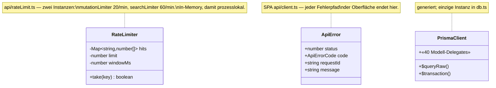

Die tragende Struktur sind stattdessen **Typen an den Schichtgrenzen**:

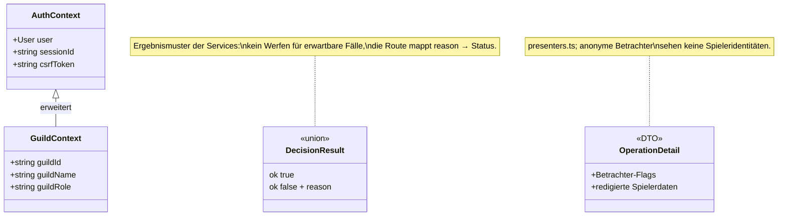

`AuthContext` beantwortet „wer", `GuildContext` zusätzlich „in welchem Mandanten und mit welcher
Rolle". Jede geschützte Route beginnt mit einer dieser beiden.

---

## 6. Datenmodell

40 Entitäten. Nach Aufgabe gruppiert; die Diagramme zeigen je Gruppe die Beziehungen und die
tragenden Felder.

### 6.1 Mandant und Identität

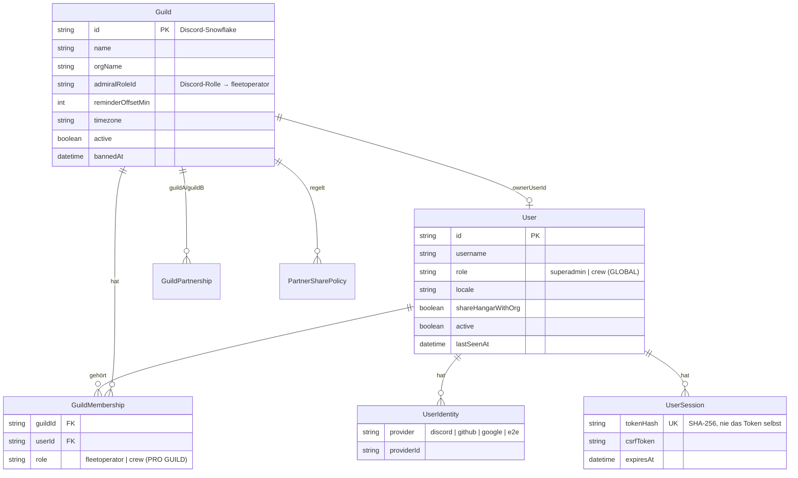

**Die wichtigste Regel des Modells:** `User.role` ist **global** und trägt praktisch nur
`superadmin`. Die operative Rolle (`fleetoperator` oder `crew`) lebt in `GuildMembership.role` —
**pro Guild**. Wer das verwechselt, baut entweder eine Rechteausweitung über alle Mandanten oder
eine Prüfung, die nie greift.

Es gibt **keine Guild-Rolle „captain"**: `GuildRole` kennt genau zwei Stufen
([`services/guilds.ts`](../apps/fleetplanner/src/services/guilds.ts)). „Captain" ist im Produkt der
Kapitän einer Einheit (`FleetUnit.captainId`) — eine Rolle *innerhalb einer Operation*, nicht im
Mandanten. Discord-seitig wird genau eine Rolle gemappt: `Guild.admiralRoleId` → `fleetoperator`.

`UserSession` speichert nur den SHA-256 des Cookie-Tokens. Ein Datenbank- oder Backup-Leck lässt sich
damit nicht als Sitzung wiedereinspielen.

### 6.2 Operation und Flottenstruktur

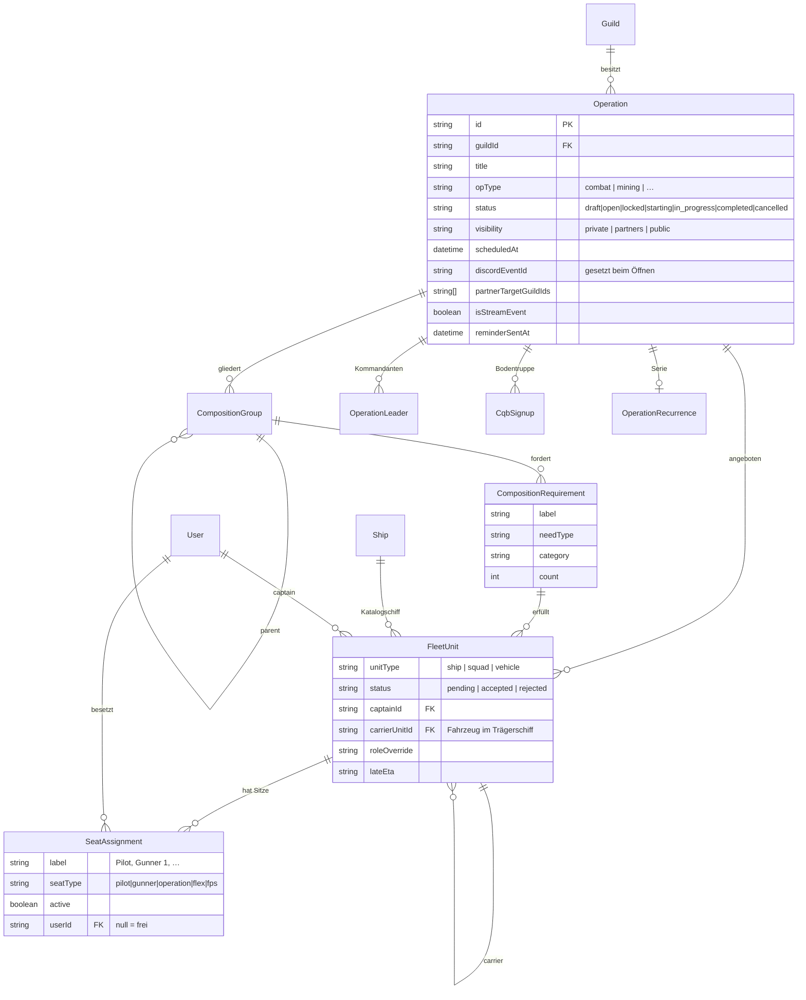

`status` und `visibility` sind **unabhängig**: eine Operation kann veröffentlicht (`open`) und
trotzdem `private` sein. `status` steuert den Lebenszyklus, `visibility` die Sichtbarkeit über die
eigene Guild hinaus.

Zwei Selbstbezüge tragen die Flottenstruktur: `FleetUnit.carrierUnitId` (Fahrzeug im Trägerschiff,
`onDelete: Cascade` — das Trägerschiff nimmt sein Fahrzeug mit) und `CompositionGroup.parentId`
(Formation in Formation, `onDelete: SetNull` — eine gelöschte Übergruppe verwaist ihre Kinder
statt sie zu löschen).

### 6.3 Discord-Kopplung, Community, Betrieb

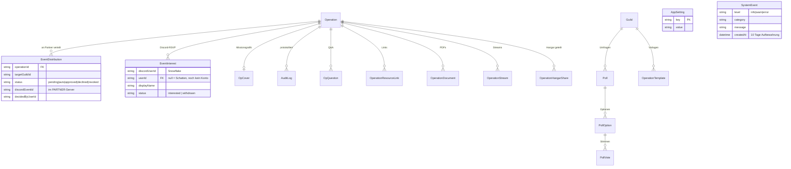

`EventInterest.userId` darf `null` sein — ein Discord-Nutzer ohne Fleetplanner-Konto wird als
**Schattenzeile** geführt und beim ersten Discord-Login übernommen (`claimInterestShadows`). Der
Operator sieht ihn sofort, ohne dass er sich je angemeldet hätte.

### 6.4 Löschverhalten

| Auslöser | Wirkung |
|---|---|
| Guild gelöscht | Kaskade auf Mitgliedschaften, Operationen, Serien, Umfragen, Vorlagen, Partnerschaften |
| Operation gelöscht | Kaskade auf Gruppen, Bedarfe, Einheiten, Sitze, Q&A, Audit, Interest, Cover, Verteilungen, Dokumente, Streams |
| User gelöscht | Kaskade auf Sessions, Identitäten, Mitgliedschaften, Hangar; `SetNull` bei Guild-Eigentum, Streams und Interest |
| CompositionGroup gelöscht | `SetNull` bei Kindgruppen, Formation-Zuordnung und CQB-Zuweisung |
| Trägereinheit gelöscht | Kaskade auf ihre Fahrzeuge |

Faustregel: **fachlich Untergeordnetes kaskadiert, Zuordnungen werden genullt.** Sitzplätze
verschwinden mit ihrer Einheit; ein Spieler bleibt bestehen, wenn seine Zuordnung wegfällt.

---

## 7. Programmablaufpläne

### 7.1 Anfrage-Pipeline

Jede Anfrage an `/api/v1` durchläuft dieselben Tore, immer in dieser Reihenfolge:

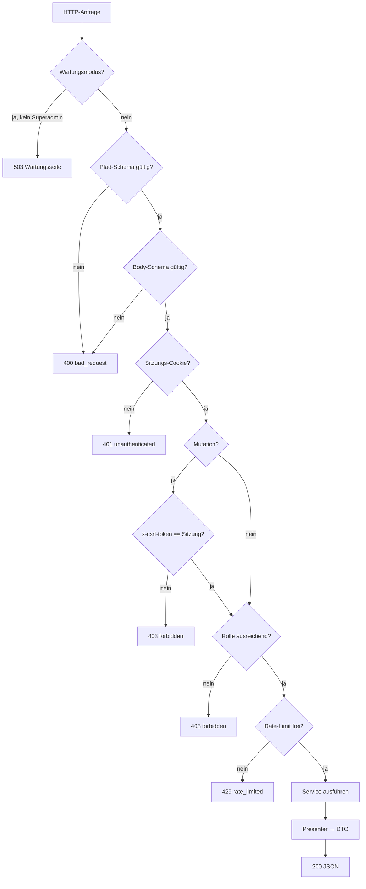

**Reihenfolge ist Sicherheit, nicht Geschmack.** Authentifizierung kommt vor der Fachprüfung, damit
ein anonymer Aufrufer nicht am Fehlertext ablesen kann, welche Felder ein Endpunkt erwartet — genau
diese Eigenschaft prüft der DB-Integrationstest „rejects an unauthenticated mutation".

Fehler verlassen das System nur in einer Form:

```json
{ "error": { "code": "forbidden", "message": "…", "requestId": "req-42" } }
```

`code` ist eine geschlossene Menge, `message` ist bereinigt (keine Stacks, keine SQL-Fragmente),
`requestId` verbindet die Antwort mit der Logzeile.

### 7.2 Anmeldung über Discord

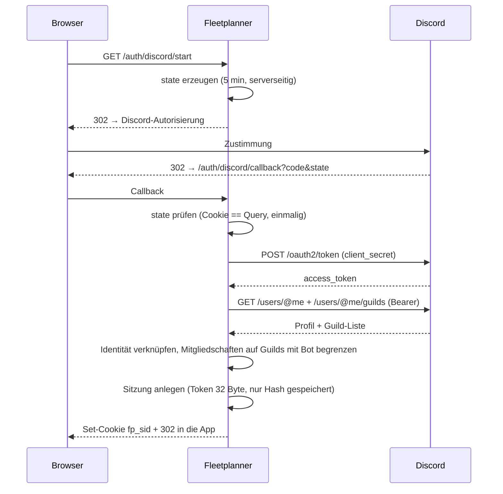

Der `state` ist einmalig und serverseitig; ein zurückgespielter Callback ohne passenden
State-Cookie wird abgewiesen, ohne dass eine Sitzung entsteht.

### 7.3 Lebenszyklus einer Operation

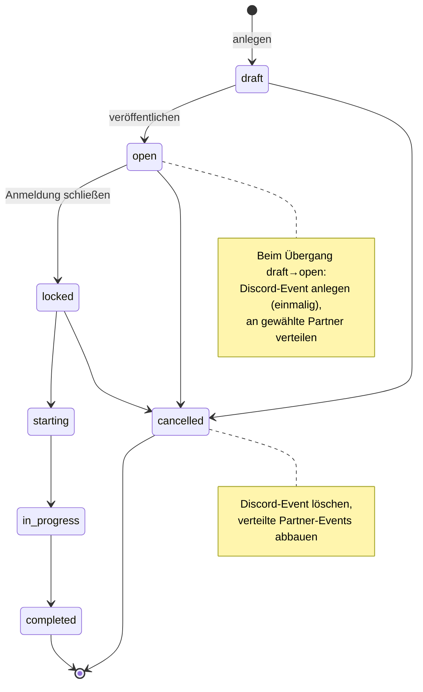

Der Übergang `draft → open` im Detail — jeder Discord-Schritt ist **best effort**:

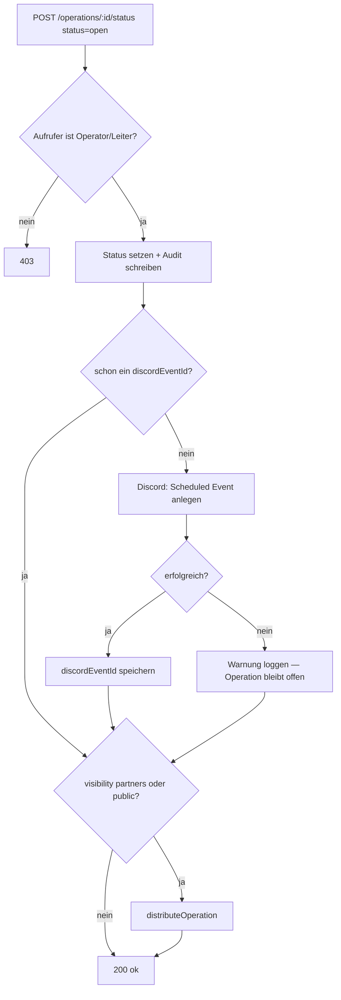

**Warum best effort:** ein Discord-Ausfall darf die Veröffentlichung nicht verhindern. Die Operation
existiert im Fleetplanner, auch wenn das Discord-Event fehlt — der umgekehrte Fall wäre
Datenverlust. Genau das prüft der E2E-Test „a Discord outage does not block publishing an op", indem
er Discord ein 429 antworten lässt.

### 7.4 Verteilung an Partner-Guilds

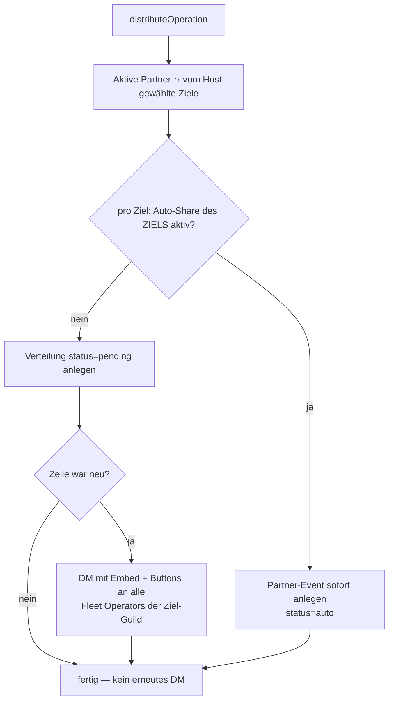

Die Richtung der Regel ist der entscheidende Punkt: **das Ziel entscheidet**, ob fremde Events bei
ihm automatisch erscheinen — nicht der Absender. Andernfalls könnte jede Partnerschaft ungefragt in
fremde Server posten.

Die Entscheidung kommt entweder aus dem Web-Postfach oder aus Discord:

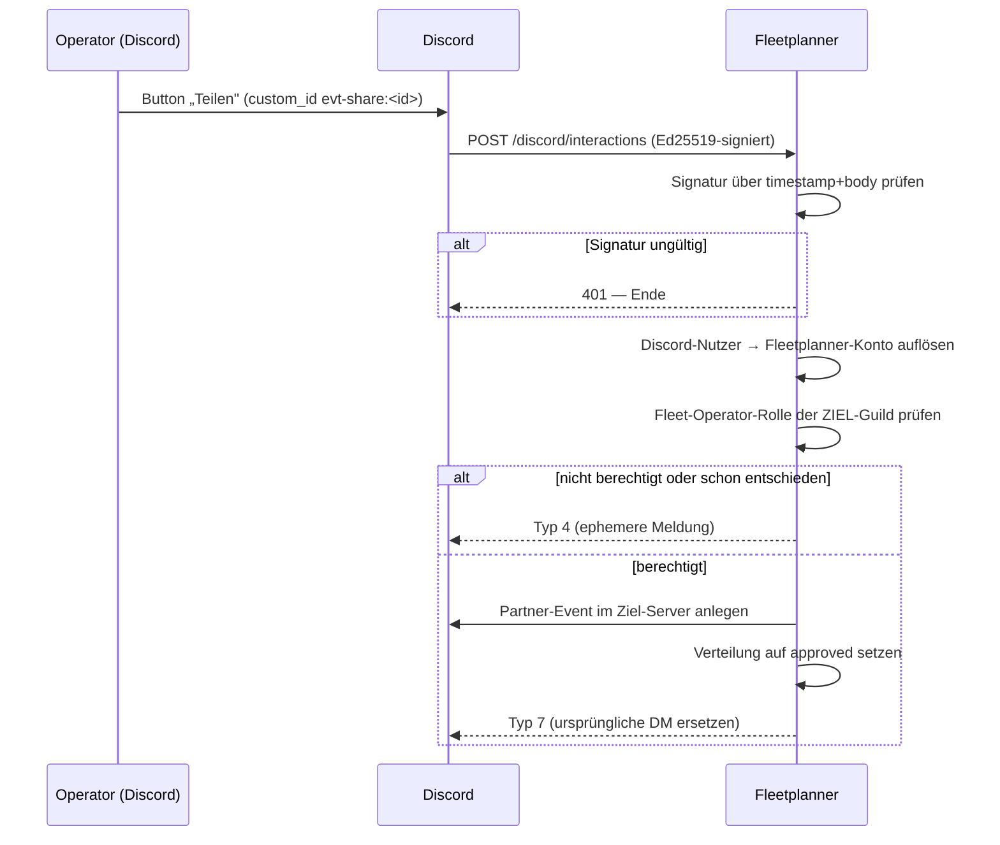

Die Signaturprüfung steht vor **jeder** Verarbeitung. Sie ist das Einzige zwischen dem offenen
Internet und „genehmigt".

### 7.5 Interest-Sync

Discord meldet RSVPs nicht ohne Gateway-Intent — also wird gepollt (Produktion 5 Minuten,
Testverbund 3 Sekunden über `EVENT_INTEREST_INTERVAL_MS`):

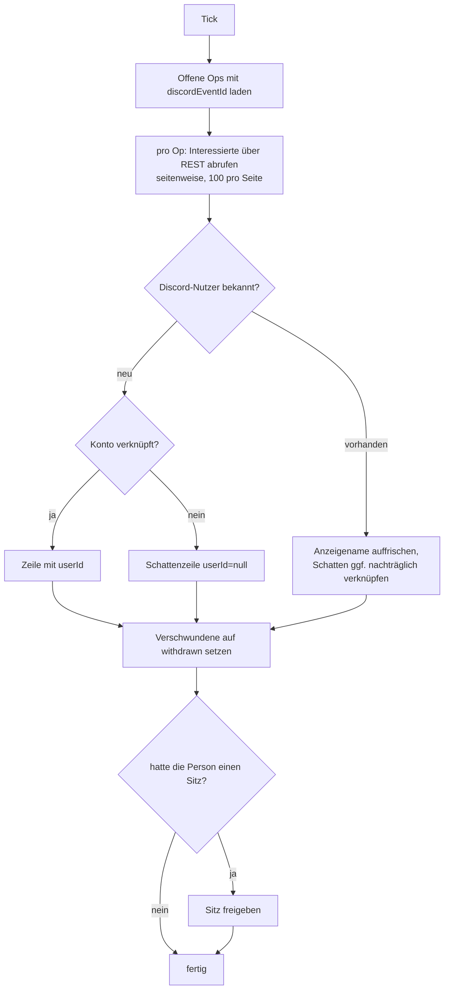

Der Rückzug gibt den Sitz frei, weil die Discord-Zusage die Quelle der Wahrheit für bloßes Interesse
ist. Ein Fehler bei einer Operation bricht den Durchlauf nicht ab — die übrigen werden weiter
synchronisiert.

### 7.6 Serien

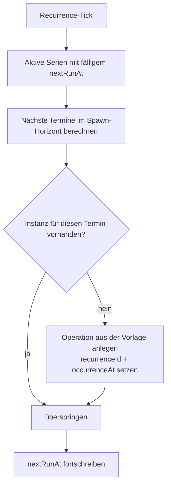

`occurrenceAt` plus die Prüfung auf eine vorhandene Instanz machen den Lauf **idempotent**: ein
doppelter Tick erzeugt keine doppelte Operation.

---

## 8. Querschnittsthemen

### 8.1 Berechtigungen

| Prüfung | Grundlage | Verwendung |
|---|---|---|
| `requireSessionJson` | Sitzung + CSRF | jede JSON-Mutation |
| `requireGuildOperator` | `GuildMembership.role == fleetoperator` | Guild-Verwaltung, Partnerschaften |
| `requireFleetOperator` | Operator, Ersteller oder Kommandant der Op | Bearbeiten, Status, Löschen |
| `requireOperator` | darf Einheiten entscheiden | Annehmen/Ablehnen, Sitzvergabe |
| `requireSuperadmin` | `User.role == superadmin` | Admin-Konsole, Instanzverwaltung |
| `effectiveOpRole` | Rolle in der Guild der Operation | Sichtbarkeitsgrenze pro Operation |

Serverseitig geprüft wird immer; die Gates in `nav.ts` sind reine Oberflächenführung, kein Schutz.

### 8.2 Hintergrundläufe

| Lauf | Takt | Aufgabe |
|---|---|---|
| Ship-Sync | wöchentlich (konfigurierbar) | Schiffskatalog aus dem SC-Wiki |
| Location-Sync | periodisch | Ortskatalog |
| Reminder | jede Minute | Erinnerungs-DMs, `reminderOffsetMin` pro Guild |
| Cover-Cleanup | periodisch | Missionsgrafiken abgeschlossener Ops nach 14 Tagen |
| Recurrence | periodisch | Serieninstanzen erzeugen |
| Interest-Sync | 5 min (Test: 3 s) | Discord-RSVPs abgleichen |
| Fleetyards | beim Start | Silhouetten-Cache auffrischen |

Alle laufen **im Anwendungsprozess**. Mehrere Instanzen desselben Containers würden doppelt
arbeiten; der Fleetplanner läuft deshalb als eine Instanz.

### 8.3 Geheimnisse

| Wert | Wirkung bei Änderung |
|---|---|
| `SESSION_SECRET` | alle Sitzungen ungültig |
| `DISCORD_FLEETPLANNER_BOT_TOKEN` | Discord-Aktionen fallen aus, Ops bleiben bestehen |
| `DISCORD_FLEETPLANNER_PUBLIC_KEY` | Interaction-Buttons werden abgewiesen (Web-Postfach funktioniert weiter) |
| `MISSIONCOVER_SERVICE_SECRET` | Cover-Funktion verschwindet aus der Oberfläche |
| `E2E_TEST_LOGIN_SECRET` | **öffnet den Test-Login** — in Produktion unbesetzt lassen |

`DISCORD_API_BASE`, `DISCORD_AUTHORIZE_BASE` und `DISCORD_SITE_BASE` zeigen per Vorgabe auf Discord.
Jede Abweichung wird beim Start laut protokolliert, weil eine umgeleitete Discord-Adresse Bot-Token
und OAuth-Geheimnisse an diesen Host schickt.

### 8.4 Prüfebenen

Vier Ebenen, alle lokal, Discord simuliert — Details in [`TESTING.md`](TESTING.md):
Backend-Unit (574), SPA-Unit (133), DB-Integration (20), E2E (119), Smoke. Der Simulator
[`tests/discord-mock`](../tests/discord-mock/) spricht die Discord-REST-Teilmenge und schickt
signierte Interactions zurück.

---

## 9. Entscheidungen und ihre Gründe

| Entscheidung | Grund | Preis |
|---|---|---|
| REST-Bot statt Gateway | kein privilegierter Intent, kein dauerhafter Socket | RSVPs kommen verzögert (Polling) |
| Discord-Nebenwirkungen best effort | eine Operation darf nicht an Discord scheitern | Zustände können auseinanderlaufen; Abgleich beim nächsten Bearbeiten |
| Rollen pro Guild statt global | ein Konto bedient mehrere Organisationen | jede Prüfung braucht den Guild-Bezug |
| Contracts als eigenes Paket | ein Typ für Backend und SPA | Paket muss vor dem SPA-Typecheck gebaut sein |
| Security-Header nur in nginx | doppelte Header widersprachen sich | Backend-Antworten sind ohne den Proxy ungeschützt |
| Sitzungstoken nur als Hash | DB-Leck ist nicht wiedereinspielbar | Sitzungen sind nicht aus der DB lesbar |
| Strangler statt Big Bang beim API-Umbau | schrittweise Ablösung, jederzeit lauffähig | der alte Layer lebte 2,5 Monate ungenutzt mit — bis 2026-08-22 |

---

## 10. Altlasten und bekannte Abweichungen

- **`packages/db` und Root-`prisma/` sind seit 2026-08-22 gelöscht** — sie gehörten zum entfernten
  Bridge/Bot-Schema und hatten keinen Konsumenten mehr. Prisma lebt nur noch in
  `apps/fleetplanner/prisma`; benutze immer `--filter @rdoc-suite/fleetplanner db:*`.
- **Vier Altfunktionen ohne Nachfolger.** Mit `routes/api.ts` (2026-08-22 gelöscht) verschwanden die
  letzten Codepfade für *Ressourcenlinks umsortieren*, *CQB-Auto-Bundle*, *Squad auflösen* und
  *Primäreinheit setzen*. Erreichbar war davon seit dem SPA-Umstieg nichts mehr.
- **Die Kapitäns-DM bei „Einheit angenommen" feuert nicht.** `sendAcceptedCaptainVoiceDm` hängt an
  keinem Endpunkt mehr; die `/api/v1`-Accept-Route schickt keine Nachricht. Bewusst stehen gelassen,
  weil die Doku die DM zusagt — anschließen ist eine Produktentscheidung.
- **Der Voice-Stack ist weg** (LiveKit 2026-06-18, Companion 2026-08-07). Der Fleetplanner überträgt
  kein Audio; er mintet nur einen Deep-Link in Subraum (subraum.cc). Die früheren **Funkrelais-Bots
  existieren nicht mehr** — kein Modell, kein Service, keine Route. Von der Voice-Ära sind nur die
  zwei `FLEETPLANNER_VOICE_CLIENT_*`-Links übrig, die an die Captain-DM angehängt werden; die toten
  `RELAY_BOTS_*`-, `RAUMDOCK_GUILD_ID`- und `DISCORD_BOT_TOKEN`-Variablen sind 2026-08-22 aus dem
  Env-Schema entfernt.
- **`MANAGE_ROLES` wird im Bot-Invite angefordert, aber nirgends benutzt.** Der Bot vergibt keine
  Discord-Rollen; er *liest* nur `admiralRoleId`. Die Berechtigung gehört aus der Invite-URL
  entfernt — das ändert die Installations-URL und ist deshalb eine eigene Entscheidung.
- **i18n ist zweischichtig:** Backend/SSR kennt fünf Sprachen, die SPA zwei. Eine neue Sprache heißt
  beide Seiten.
- **Die Hintergrundläufe sind nicht mehrinstanzfähig.** Horizontale Skalierung erfordert vorher eine
  Verlagerung der Läufe oder eine Führungswahl.
